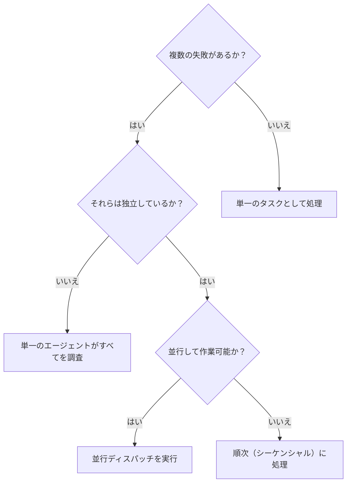

# 並行エージェントのディスパッチ (Dispatching Parallel Agents)

## 概要

複数の無関係な失敗（異なるテストファイル、異なるサブシステム、異なるバグ）が発生している場合、それらを順次調査するのは時間の無駄です。それぞれの調査は独立しており、並行して進めることができます。

**コア原則:** 独立した問題ドメインごとに1つのエージェント（またはタスク）を割り当て、並行して作業を進行させる。

## 使用タイミング



**使用すべきケース:**
- 異なる根本原因を持つ3つ以上のテストファイルが失敗している。
- 複数のサブシステムが独立して破損している。
- 各問題を、他の問題のコンテキストなしで理解できる。
- 調査間に共有状態（副作用の競合）がない。

**使用すべきでないケース:**
- 失敗が関連している（1つを直せば他も直る可能性がある）。
- システム全体のフルコンテキストを理解する必要がある。
- エージェント同士が干渉する可能性がある（同じファイルを編集するなど）。

## Gemini CLI での実現方法

Gemini CLI 自体はシングルスレッドですが、以下の手法で「並行性」を実現できます。

1. **マルチ・ワークツリー戦略 (Human-driven Parallelism):**
   - `using-git-worktrees` を使い、問題ごとに独立したワークツリーを作成します。
   - 複数のターミナルを開き、それぞれのワークツリーで Gemini CLI を起動して、独立した課題を同時に依頼します。
2. **バックグラウンド実行:**
   - `run_shell_command` の `is_background: true` を使用し、長時間実行されるテストやビルドをバックグラウンドで走らせます。その間に AI エージェントは別の調査を進めることができます。
3. **論理的並行:**
   - `subagent-driven-development` と組み合わせ、巨大な課題を「独立したサブタスク」に分割します。

## パターン

### 1. 独立したドメインの特定

何が壊れているかに基づいて失敗をグループ化します。
- ファイルAのテスト: ツール承認フロー
- ファイルBのテスト: バッチ完了動作
- ファイルCのテスト: 中断（Abort）機能

各ドメインは独立しています。

### 2. フォーカスしたタスクの作成

各タスク（各エージェントまたは各ワークツリー）に含めるべき内容:
- **具体的なスコープ:** 1つのテストファイルまたは1つのサブシステム。
- **明確なゴール:** 対象のテストをパスさせる。
- **制約:** 他のコードは変更しない。
- **期待される出力:** 発見したことと修正した内容の要約。

### 3. 並行実行と統合

タスクが完了したら:
- 各要約を確認し、修正が互いに競合していないか検証する。
- フルテストスイートを実行する。
- すべての変更を統合する。

## エージェントプロンプトの構造

優れたプロンプトの条件:
1. **フォーカスしている** - 1つの明確な問題ドメイン。
2. **自己完結している** - 問題を理解するために必要なコンテキストが含まれている。
3. **出力が具体的** - エージェントが何を返すべきかが明確。

### 例（個別のワークツリーやサブエージェントへの依頼）:
```markdown
src/agents/agent-tool-abort.test.ts にある3つの失敗しているテストを修正してください:

1. "should abort tool with partial output capture" - メッセージに 'interrupted at' を期待している。
2. "should handle mixed completed and aborted tools" - 完了すべき高速ツールが中断されている。
3. "should properly track pendingToolCount" - 3つの結果を期待しているが 0 になっている。

これらはタイミングやレースコンディションの問題です。あなたのタスク:

1. テストファイルを読み、各テストが何を検証しているか理解する。
2. 根本原因を特定する。
3. 修正し、要約を返す。

本番コードは最小限の変更に留めてください。
```

## よくある間違い

**❌ 範囲が広すぎる:** 「すべてのテストを直して」 → エージェントが迷子になる。
**✅ 具体的:** 「agent-tool-abort.test.ts を修正して」 → スコープが明確。

## 主な利点

1. **並列化** - 複数の調査が同時に進行する（マルチターミナル等）。
2. **フォーカス** - 各タスクのスコープが狭いため、追跡すべきコンテキストが少なくて済む。
3. **スピード** - 順次処理するよりも圧倒的に早く解決できる。
