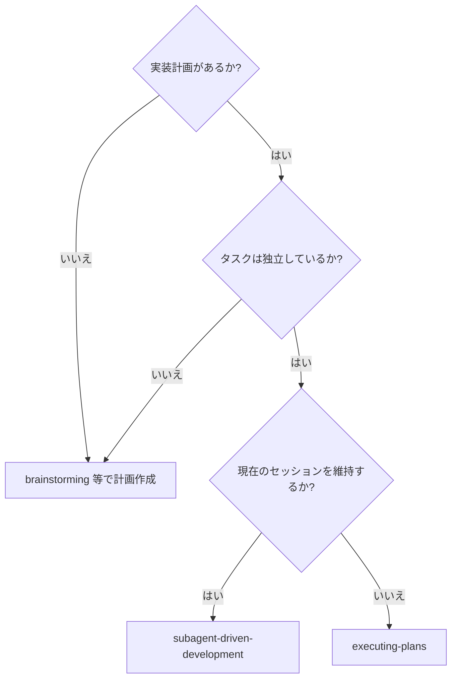
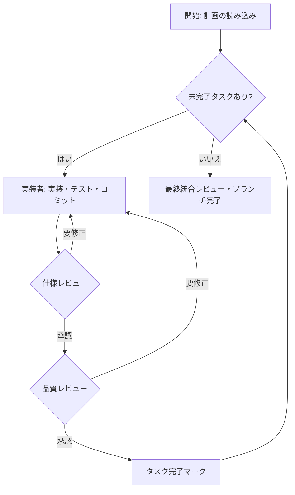

# Subagent-Driven Development

実装計画を、タスクごとに新鮮な視点（ペルソナ）で実行し、各タスク完了後に「仕様準拠レビュー」と「コード品質レビュー」の2段階レビューを行うことで、高品質な成果を目指します。

**中心原則:** タスクごとのペルソナ切り替え + 2段階レビュー = 高品質と迅速なイテレーション

## 概要 (Overview)

このスキルは、事前に作成された実装計画を実行するためのものです。計画内のタスクが互いに独立している場合に特に有効です。



`executing-plans` とは異なり、現在のセッションを継続したまま、タスクごとにペルソナを切り替えることで、コンテキストの混同を防ぎつつ体系的なレビュープロセスを強制します。

### 前提条件

-   `writing-plans`スキル等を用いて、実行すべき実装計画がファイルに記述されていること。
-   `using-git-worktrees`スキル等を使い、隔離されたGitワークツリーまたはフィーチャーブランチで作業していること。

## プロセス (The Process)



**AIエージェントへの指示:** 以下のプロセスを厳密に実行してください。

### フェーズ 1: 準備

1.  **計画ファイルの特定:** ユーザーに実装計画が記述されたファイルのパスを尋ねてください。
2.  **計画の読み込みとタスクの抽出:** `read_file`ツールで計画ファイルを読み込み、実行すべき個別のタスクをすべて特定・抽出します。
3.  **ToDoリストの作成:** `run_shell_command`を使い、`node scripts/todo.mjs init <タイトル>` でToDoファイルを初期化した後、抽出した各タスクを `node scripts/todo.mjs add <タスク内容>` でリストアップしてください。

### フェーズ 2: タスク実行サイクル

**指示:** ToDoリストの未完了タスクがなくなるまで、タスクごとに以下のサイクルを繰り返します。

1.  **次のタスクの特定:** `node scripts/todo.mjs show` でToDoリストを確認し、次の未完了タスクを `node scripts/todo.mjs start <検索パターン>` で実行中状態（`[/]`）に更新します。
2.  **役割変更: 実装者 (Implementer):**
    *   `./implementer-prompt.md` を使用して、実装サブエージェントをディスパッチします。

3.  **役割変更: 仕様レビュアー (Spec Reviewer):**
    *   `./spec-reviewer-prompt.md` を使用して、仕様準拠レビューアサブエージェントをディスパッチします。

4.  **役割変更: コード品質レビュアー (Code Quality Reviewer):**
    *   `./code-quality-reviewer-prompt.md` を使用して、コード品質レビューアサブエージェントをディスパッチします。

5.  **タスク完了:**
    *   仕様レビューと品質レビューの両方で承認されたら、`run_shell_command`を使い `node scripts/todo.mjs done` を実行して、該当タスクを完了状態（`[x]`）に更新します。

### フェーズ 3: 最終化

1.  **全タスク完了の確認:** `node scripts/todo.mjs show` でToDoリストを確認し、すべてのタスクが完了（`[x]`）したことを確認します。
2.  **最終レビュー:** 全体の実装に矛盾がないか、統合上の問題がないかを確認します。
3.  **開発ブランチの完了:**
    *   `activate_skill`ツールを使い、`finishing-a-development-branch`スキルを起動します。
    *   `finishing-a-development-branch`スキルの指示に従い、プルリクエストの作成やマージなどの最終作業を行ってください。

## プロンプトテンプレート (Prompt Templates)

-   `./implementer-prompt.md` - 実装者サブエージェントをディスパッチ
-   `./spec-reviewer-prompt.md` - 仕様準拠レビューアサブエージェントをディスパッチ
-   `./code-quality-reviewer-prompt.md` - コード品質レビューアサブエージェントをディスパッチ

## 例示ワークフロー

```
あなた: 私はこの計画を実行するためにサブエージェント駆動開発を使用しています。

[計画ファイルを一度読み込む: docs/plans/feature-plan.md]
[すべての5つのタスクを全文とコンテキストと共に抽出]
[すべてのタスクでTodoWriteを作成]

タスク 1: フックインストールスクリプト

[タスク 1 のテキストとコンテキストを取得 (既に抽出済み)]
[完全なタスクテキストとコンテキストで実装サブエージェントをディスパッチ]

実装者: 「開始する前に - フックはユーザーレベルまたはシステムレベルのどちらにインストールすべきですか？」

あなた: 「ユーザーレベル (~/.config/superpowers/hooks/)」

実装者: 「了解しました。今から実装します...」
[その後] 実装者:
  - インストールフックコマンドを実装
  - テストを追加、5/5 合格
  - 自己レビュー: --force フラグを見落としていたため追加
  - コミット済み

[仕様準拠レビューアをディスパッチ]
仕様レビューア: ✅ 仕様に準拠 - すべての要件を満たしており、余分なものなし

[Git SHA を取得し、コード品質レビューアをディスパッチ]
コードレビューア: 強み: 良好なテストカバレッジ、クリーン。問題点: なし。承認済み。

[タスク 1 を完了としてマーク]

タスク 2: 回復モード

[タスク 2 のテキストとコンテキストを取得 (既に抽出済み)]
[完全なタスクテキストとコンテキストで実装サブエージェントをディスパッチ]

実装者: [質問なし、続行]
実装者:
  - 検証/修復モードを追加
  - 8/8 テスト合格
  - 自己レビュー: 全て良好
  - コミット済み

[仕様準拠レビューアをディスパッチ]
仕様レビューア: ❌ 問題点:
  - 欠落: 進捗報告 (仕様では「100項目ごとに報告」と記載)
  - 余分: --json フラグを追加 (要求されていない)

[実装者が問題を修正]
実装者: --json フラグを削除、進捗報告を追加

[仕様レビューアが再レビュー]
仕様レビューア: ✅ 仕様に準拠

[コード品質レビューアをディスパッチ]
コードレビューア: 強み: 堅実。問題点 (重要): マジックナンバー (100)

[実装者が修正]
実装者: PROGRESS_INTERVAL 定数を抽出

[コードレビューアが再レビュー]
コードレビューア: ✅ 承認済み

[タスク 2 を完了としてマーク]

...

[すべてのタスク完了後]
[最終コードレビューアをディスパッチ]
最終レビューア: すべての要件を満たしています。マージ準備完了。

完了！
```

## 参考情報 (Reference)

## 利点

**手動実行との比較:**
- サブエージェントは自然にTDDに従う
- タスクごとに新鮮なコンテキスト (混乱なし)
- 並行安全 (サブエージェントは干渉しない)
- サブエージェントは質問可能 (作業前と作業中)

**実行計画との比較:**
- 同じセッション (ハンドオフなし)
- 継続的な進捗 (待機なし)
- レビューチェックポイントは自動

**効率向上:**
- ファイル読み込みのオーバーヘッドなし (コントローラーが全文を提供)
- コントローラーが必要なコンテキストを正確にキュレーション
- サブエージェントは完全な情報を事前に取得
- 作業開始前に質問が表面化 (後からではない)

**品質ゲート:**
- 自己レビューは引き渡し前に問題を捕捉
- 2段階レビュー: 仕様準拠、その後コード品質
- レビーループは修正が実際に機能することを確認
- 仕様準拠は過剰/不十分な構築を防止
- コード品質は実装が適切に構築されていることを保証

**コスト:**
- より多くのサブエージェント呼び出し (実装者 + タスクごとに2人のレビューア)
- コントローラーはより多くの準備作業を行う (すべてのタスクを事前に抽出)
- レビーループは反復を追加
- しかし、問題を早期に捕捉するため、後でデバッグするよりも安価

### 重要なルール (Red Flags)

-   **レビューのスキップは厳禁:** 仕様レビューまたはコード品質レビューのいずれかを省略してはなりません。
-   **未修正での進行の禁止:** レビューで指摘された問題が修正・再レビューされるまで、次のタスクに進んではなりません。
-   **レビューの順序:** 必ず「仕様レビュー」が完了してから「コード品質レビュー」を行ってください。
-   **実装者による自己承認の禁止:** 実装者が自身のレビューを承認してはなりません。必ずペルソナを切り替えてください。

**決してしてはならないこと:**
- 明示的なユーザーの同意なしに main/master ブランチで実装を開始する
- レビューをスキップする (仕様準拠またはコード品質)
- 未修正の問題があるまま続行する
- 複数の実装サブエージェントを並行してディスパッチする (競合が発生するため)
- サブエージェントに計画ファイルを読み込ませる (代わりに全文を提供する)
- 場面設定のコンテキストを省略する (サブエージェントはタスクがどこに適合するかを理解する必要がある)
- サブエージェントの質問を無視する (彼らが続行する前に回答する)
- 仕様準拠において「十分近い」を受け入れる (レビューアが問題を発見した場合、完了ではない)
- レビーループをスキップする (レビューアが問題を発見した場合、実装者が修正し、再度レビューする)
- 実装者の自己レビューが実際のレビューを置き換えることを許す (両方が必要)
- **仕様準拠が ✅ になる前にコード品質レビューを開始する** (順序が間違っている)
- いずれかのレビューで未解決の問題がある間に次のタスクに進む

**サブエージェントが質問した場合:**
- 明確かつ完全に回答する
- 必要に応じて追加のコンテキストを提供する
- 実装を急がせない

**レビューアが問題を発見した場合:**
- 実装者 (同じサブエージェント) がそれらを修正する
- レビューアが再レビューする
- 承認されるまで繰り返す
- 再レビューをスキップしない

**サブエージェントがタスクに失敗した場合:**
- 特定の指示で修正サブエージェントをディスパッチする
- 手動で修正しようとしない (コンテキスト汚染のため)

### 連携スキル (Integration)

-   **必須:** `using-git-worktrees`, `writing-plans`, `finishing-a-development-branch`
-   **推奨:** 実装者は`test-driven-development`スキルの原則に従うことが望ましい。
