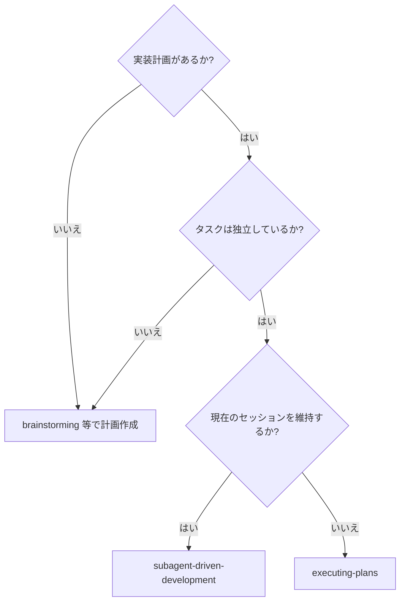
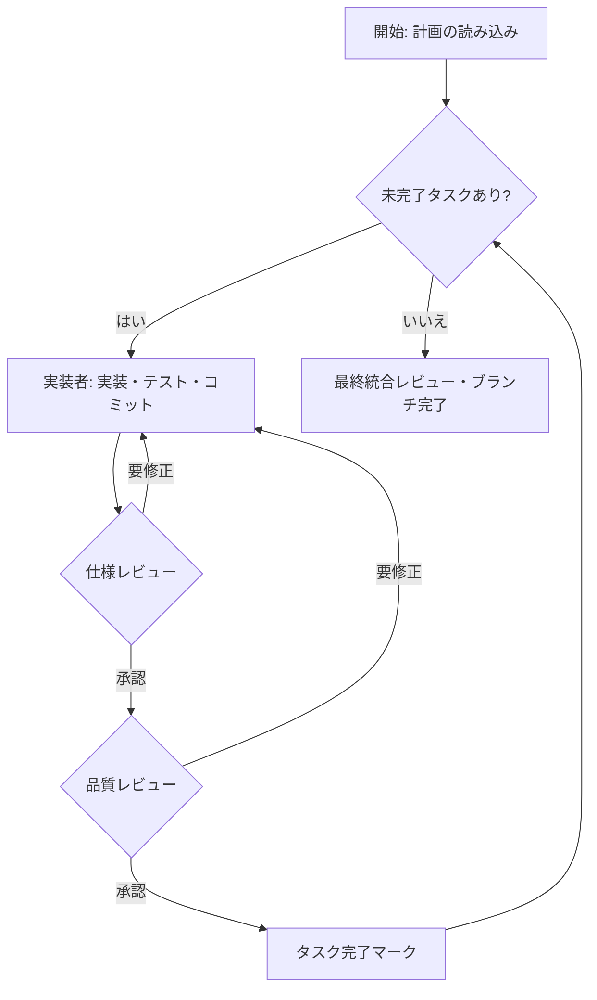

# Subagent-Driven Development

実装計画を、タスクごとに新鮮な視点（ペルソナ）で実行し、各タスク完了後に「仕様準拠レビュー」と「コード品質レビュー」の2段階レビューを行うことで、高品質な成果を目指します。

**中心原則:** タスクごとのペルソナ切り替え + 2段階レビュー = 高品質と迅速なイテレーション

## 概要 (Overview)

このスキルは、事前に作成された実装計画を実行するためのものです。計画内のタスクが互いに独立している場合に特に有効です。

`executing-plans` とは異なり、現在のセッションを継続したまま、タスクごとにペルソナを切り替えることで、コンテキストの混同を防ぎつつ体系的なレビュープロセスを強制します。

### 前提条件

-   `writing-plans`スキル等を用いて、実行すべき実装計画がファイルに記述されていること。
-   `using-git-worktrees`スキル等を使い、隔離されたGitワークツリーまたはフィーチャーブランチで作業していること。

## プロセス (The Process)

**AIエージェントへの指示:** 以下のプロセスを厳密に実行してください。

### フェーズ 1: 準備

1.  **計画ファイルの特定:** ユーザーに実装計画が記述されたファイルのパスを尋ねてください。
2.  **計画の読み込みとタスクの抽出:** `read_file`ツールで計画ファイルを読み込み、実行すべき個別のタスクをすべて特定・抽出します。
3.  **ToDoリストの作成:** `run_shell_command`を使い、`python3 scripts/todo.py init <タイトル>` でToDoファイルを初期化した後、抽出した各タスクを `python3 scripts/todo.py add <タスク内容>` でリストアップしてください。

### フェーズ 2: タスク実行サイクル

**指示:** ToDoリストの未完了タスクがなくなるまで、タスクごとに以下のサイクルを繰り返します。

1.  **次のタスクの特定:** `python3 scripts/todo.py show` でToDoリストを確認し、次の未完了タスクを `python3 scripts/todo.py start <検索パターン>` で実行中状態（`[/]`）に更新します。
2.  **役割変更: 実装者 (Implementer):**
    *   `./implementer-prompt.md` を使用して、実装サブエージェントをディスパッチします。

3.  **役割変更: 仕様レビュアー (Spec Reviewer):**
    *   `./spec-reviewer-prompt.md` を使用して、仕様準拠レビューアサブエージェントをディスパッチします。

4.  **役割変更: コード品質レビュアー (Code Quality Reviewer):**
    *   `./code-quality-reviewer-prompt.md` を使用して、コード品質レビューアサブエージェントをディスパッチします。

5.  **タスク完了:**
    *   仕様レビューと品質レビューの両方で承認されたら、`run_shell_command`を使い `python3 scripts/todo.py done` を実行して、該当タスクを完了状態（`[x]`）に更新します。

### フェーズ 3: 最終化

1.  **全タスク完了の確認:** `python3 scripts/todo.py show` でToDoリストを確認し、すべてのタスクが完了（`[x]`）したことを確認します。
2.  **最終レビュー:** 全体の実装に矛盾がないか、統合上の問題がないかを確認します。
3.  **開発ブランチの完了:**
    *   `activate_skill`ツールを使い、`finishing-a-development-branch`スキルを起動します。
    *   `finishing-a-development-branch`スキルの指示に従い、プルリクエストの作成やマージなどの最終作業を行ってください。

## プロンプトテンプレート (Prompt Templates)

-   `./implementer-prompt.md` - 実装者サブエージェントをディスパッチ
-   `./spec-reviewer-prompt.md` - 仕様準拠レビューアサブエージェントをディスパッチ
-   `./code-quality-reviewer-prompt.md` - コード品質レビューアサブエージェントをディスパッチ

## 参考情報 (Reference)

### 重要なルール (Red Flags)

-   **レビューのスキップは厳禁:** 仕様レビューまたはコード品質レビューのいずれかを省略してはなりません。
-   **未修正での進行の禁止:** レビューで指摘された問題が修正・再レビューされるまで、次のタスクに進んではなりません。
-   **レビューの順序:** 必ず「仕様レビュー」が完了してから「コード品質レビュー」を行ってください。
-   **実装者による自己承認の禁止:** 実装者が自身のレビューを承認してはなりません。必ずペルソナを切り替えてください。

### 連携スキル (Integration)

-   **必須:** `using-git-worktrees`, `writing-plans`, `finishing-a-development-branch`
-   **推奨:** 実装者は`test-driven-development`スキルの原則に従うことが望ましい。
