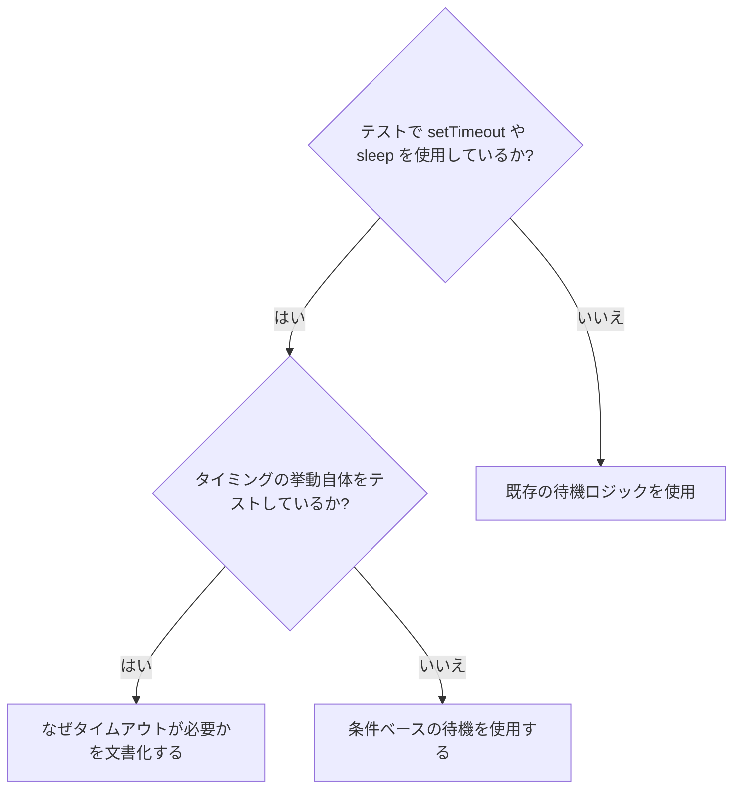

# 条件ベースの待機 (Condition-Based Waiting)

## 概要

不安定なテスト（Flaky tests）は、しばしば任意の遅延時間（スリープ）を置いてタイミングを推測しています。これにより、高速なマシンではパスするが、負荷のかかった状態やCI環境では失敗するという競合状態（Race Condition）が発生します。

**中核原則:** 処理にかかる時間を推測するのではなく、関心のある「実際の条件」が満たされるまで待機すること。

## いつ使用するか



**ユースケース:**
- テストに任意の遅延（`setTimeout`, `sleep`, `time.sleep()`）がある。
- テストが不安定（時々パスし、負荷がかかると失敗する）。
- 並列実行時にテストがタイムアウトする。
- 非同期操作の完了を待機する必要がある。

**使用しないケース:**
- デバウンス（debounce）やスロットル（throttle）の間隔など、実際の「時間的挙動」をテストしている場合。
- 任意のタイムアウトを使用する場合は、常に「なぜ（WHY）」を文書化してください。

## コアパターン

```typescript
// ❌ 以前: タイミングを推測している
await new Promise(r => setTimeout(r, 50));
const result = getResult();
expect(result).toBeDefined();

// ✅ 以降: 条件を待機している
await waitFor(() => getResult() !== undefined);
const result = getResult();
expect(result).toBeDefined();
```

## クイックパターン

| シナリオ | パターン |
|----------|---------|
| イベントを待つ | `waitFor(() => events.find(e => e.type === 'DONE'))` |
| 状態を待つ | `waitFor(() => machine.state === 'ready')` |
| 個数を待つ | `waitFor(() => items.length >= 5)` |
| ファイルを待つ | `waitFor(() => fs.existsSync(path))` |
| 複雑な条件 | `waitFor(() => obj.ready && obj.value > 10)` |

## 実装例

汎用的なポーリング関数：
```typescript
async function waitFor<T>(
  condition: () => T | undefined | null | false,
  description: string,
  timeoutMs = 5000
): Promise<T> {
  const startTime = Date.now();

  while (true) {
    const result = condition();
    if (result) return result;

    if (Date.now() - startTime > timeoutMs) {
      throw new Error(`${timeoutMs}ms 待機しましたが、${description} の条件が満たされませんでした`);
    }

    await new Promise(r => setTimeout(r, 10)); // 10ms ごとにポーリング
  }
}
```

## よくある間違い

- **❌ ポーリングが速すぎる:** `setTimeout(check, 1)` - CPUを無駄に消費する。
  - **✅ 修正:** 10ms 程度の間隔にする。
- **❌ タイムアウトがない:** 条件が満たされない場合に無限ループになる。
  - **✅ 修正:** 常に明確なエラーを伴うタイムアウトを含める。
- **❌ 古いデータ:** ループの外で取得した状態を使い続ける。
  - **✅ 修正:** ループ内で常に最新のデータを取得するゲッターを呼び出す。

## 任意のタイムアウトが「正しい」場合

```typescript
// ツールが 100ms ごとに実行される場合 - 2回分の出力を確認するために待つ
await waitForEvent(manager, 'TOOL_STARTED'); // まずは開始条件を待つ
await new Promise(r => setTimeout(r, 200));   // 次に、時間的挙動を待つ
// 200ms = 100ms 間隔で 2回分 - 文書化され正当化されている
```

**要件:**
1. まず、トリガーとなる条件を待機する。
2. 推測ではなく、既知のタイミングに基づいている。
3. なぜ（WHY）その時間が必要かを示すコメントがある。
