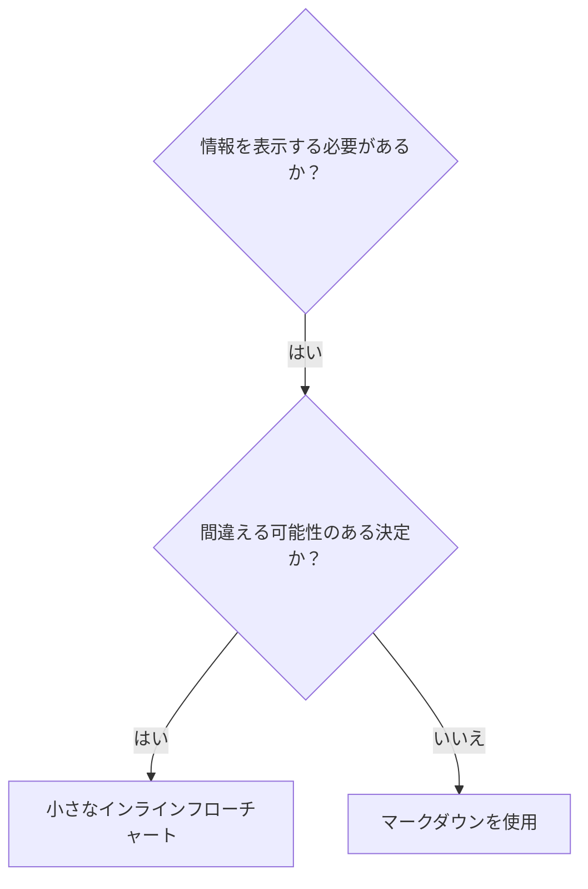

# スキルの作成

## 概要

**スキルの作成とは、プロセス文書にテスト駆動開発（TDD）を適用することです。**

**個人のスキルは、プロジェクト固有のディレクトリ（`.gemini/skills/`）またはグローバルディレクトリ（`~/.gemini/skills/`）に配置されます。**

あなたはテストケース（圧力シナリオ）を書き、それが失敗するのを見て（ベースラインの振る舞い）、スキル（ドキュメント）を書き、テストが成功するのを見て（エージェントが従う）、リファクタリング（抜け穴を塞ぐ）します。

**中心的な原則：** スキルなしでエージェントが失敗するのを見ていなければ、そのスキルが正しいことを教えているのか分かりません。

**必須の背景知識：** このスキルを使用する前に、`test-driven-development`を理解している必要があります。そのスキルは基本的なRED-GREEN-REFACTORサイクルを定義しています。このスキルはTDDをドキュメンテーションに適応させます。

## スキルとは何か？

**スキル**とは、実績のある技術、パターン、またはツールのためのリファレンスガイドです。スキルは、将来のAIエージェントインスタンスが効果的なアプローチを見つけて適用するのに役立ちます。

**スキルであるもの：** 再利用可能な技術、パターン、ツール、リファレンスガイド

**スキルでないもの：** あなたが一度問題を解決した方法についての物語

## スキルのためのTDDマッピング

| TDDの概念 | スキル作成 |
| --- | --- |
| **テストケース** | 圧力シナリオ |
| **本番コード** | スキルドキュメント (SKILL.md) |
| **テスト失敗 (RED)** | エージェントがスキルなしでルールに違反する (ベースライン) |
| **テスト成功 (GREEN)** | エージェントがスキルありで従う |
| **リファクタリング** | 準拠を維持しながら抜け穴を塞ぐ |
| **最初にテストを書く**| スキルを書く前にベースラインシナリオを実行する |
| **失敗するのを見る** | エージェントが使用する正確な正当化を文書化する |
| **最小限のコード** | それらの特定の違反に対処するスキルを書く |
| **成功するのを見る** | エージェントが今や従うことを確認する |
| **リファクタリングサイクル** | 新しい正当化を見つける → 塞ぐ → 再検証する |

スキル作成プロセス全体がRED-GREEN-REFACTORに従います。

## いつスキルを作成するか

**作成する時：**
- その技術が直感的に明らかでなかった場合
- プロジェクトをまたいでこれを再度参照する場合
- パターンが広く適用される場合（プロジェクト固有ではない）
- 他の人が恩恵を受ける場合

**作成しない時：**
- 一度きりの解決策
- 他で十分に文書化されている標準的なプラクティス
- プロジェクト固有の規約（プロジェクトの`GEMINI.md`に記述）
- 機械的な制約（正規表現/検証で強制可能なら自動化する—判断が必要な場合にドキュメントを保存する）

## スキルの種類

### 技術（Technique）
従うべきステップがある具体的な手法（例：`systematic-debugging`）

### パターン（Pattern）
問題についての考え方（例：`test-driven-development`）

### リファレンス（Reference）
APIドキュメント、構文ガイド、ツールドキュメント。

## ディレクトリ構造


```
skills/
  skill-name/
    SKILL.md              # 主要なリファレンス（必須）
    supporting-file.*     # 必要な場合のみ
```

**フラットな名前空間** - すべてのスキルが検索可能な一つの名前空間にあります。

**ファイルを分ける場合：**
1. **重いリファレンス**（100行以上） - APIドキュメント、包括的な構文
2. **再利用可能なツール** - スクリプト、ユーティリティ、テンプレート

**インラインに保つもの：**
- 原則と概念
- コードパターン（50行未満）
- その他すべて

## SKILL.mdの構造

**Frontmatter (YAML):**
- サポートされているフィールドは`name`と`description`の2つだけです。
- 合計で最大1024文字。
- `name`: 文字、数字、ハイフンのみを使用（括弧、特殊文字は不可）。
- `description`: 三人称で、いつ使用するかのみを記述します（何をするかは記述しない）。
  - 「Use when...」またはトリガー条件に焦点を当てた説明的なフレーズで始めます。
  - 特定の症状、状況、文脈を含めます。
  - **スキルのプロセスやワークフローを絶対に要約しない**（理由はGSOのセクションを参照）。
  - 可能であれば500文字未満に保ちます。

```markdown
---
name: skill-name-with-hyphens
description: Use when [特定のトリガー条件と症状]
---

# スキル名

## 概要
これは何か？中心的な原則を1〜2文で。

## いつ使用するか
[決定が自明でない場合は、小さなインラインのフローチャート]

症状とユースケースの箇条書き
いつ使用しないか

## コアパターン（技術/パターンの場合）
Before/afterのコード比較

## クイックリファレンス
一般的な操作をざっと見るための表または箇条書き

## 実装
単純なパターンのためのインラインコード
重いリファレンスや再利用可能なツールのためのファイルへのリンク

## よくある間違い
何が問題で、どう修正するか

## 実世界での影響（任意）
具体的な結果

### ローカル・アダプテーションの追加 (Gemini CLI固有)

**既存のスキルを更新**し、実戦で得られた知見を反映させる場合、`## ローカル・アダプテーション (Gemini固有)` セクションをSKILL.mdの末尾に追記します。これにより、元の移植内容とローカルでの改善を明確に分離できます。

**フォーマット:**
```markdown
## ローカル・アダプテーション (Gemini固有)
<!-- IMPROVED_ON: YYYY-MM-DD | REASON: ... -->
### AIエージェントへの指示 (Gemini固有)
- [改善された具体的な手順や注意点]
```
*   `IMPROVED_ON`: 改善を行った日付を記述します。
*   `REASON`: なぜこの改善が必要だったのか、具体的な理由を簡潔に記述します。
*   `AIエージェントへの指示 (Gemini固有)`: 将来のAIエージェントが従うべき、更新された具体的な指示を記述します。

**注意:** このセクションを追加する前に、`scripts/reset_skill.py` が存在し、このセクションを削除できることを確認してください。
```


## Gemini検索最適化 (GSO)

**発見のために重要：** 将来のGeminiエージェントがあなたのスキルを見つける必要があります。

### 1. 豊富なDescriptionフィールド

**目的：** エージェントは、特定のタスクに対してどのスキルを読み込むかを決定するためにdescriptionを読みます。「今すぐこのスキルを読むべきか？」という問いに答えるようにします。

**フォーマット：** トリガー条件に焦点を当てるために、「Use when...」または説明的なフレーズで始めます。

**重要：Description = いつ使用するか、であり、スキルが何をするか、ではない**

descriptionはトリガー条件のみを記述すべきです。スキルのプロセスやワークフローをdescriptionで要約しないでください。

**なぜこれが重要か：** テストによると、descriptionがスキルのワークフローを要約すると、エージェントは完全なスキルコンテンツを読む代わりにdescriptionに従う可能性があることが明らかになりました。「タスク間のコードレビュー」というdescriptionは、スキルのフローチャートが明確に2つのレビュー（仕様準拠とコード品質）を示しているにもかかわらず、エージェントに1つのレビューだけを行わせました。

descriptionが「独立したタスクを持つ実装計画を実行する場合」（ワークフローの要約なし）に変更されたとき、エージェントは正しくフローチャートを読み、2段階のレビュープロセスに従いました。

**罠：** ワークフローを要約するdescriptionは、エージェントが取るショートカットを作成します。スキル本体は、エージェントがスキップするドキュメントになります。

```yaml
# ❌ 悪い例：ワークフローを要約している - エージェントがスキルを読む代わりにこれに従うかもしれない
description: 計画を実行する際に使用 - タスクごとにサブタスクをディスパッチし、タスク間にコードレビューを行う

# ❌ 悪い例：プロセスの詳細が多すぎる
description: TDD用 - 最初にテストを書き、それが失敗するのを見て、最小限のコードを書き、リファクタリングする

# ✅ 良い例：トリガー条件のみ、ワークフローの要約なし
description: 現在のセッションで独立したタスクを持つ実装計画を実行する場合に使用

# ✅ 良い例：トリガー条件のみ
description: 機能やバグ修正を実装する際、実装コードを書く前に使用
```

**内容：**
- このスキルが適用されることを示す具体的なトリガー、症状、状況を使用します。
- *問題*（競合状態、一貫性のない振る舞い）を記述し、*言語固有の症状*（setTimeout、sleep）は記述しません。
- スキル自体が技術固有でない限り、トリガーは技術に依存しないようにします。
- スキルが技術固有の場合は、トリガーでそれを明示します。
- 三人称で書きます（システムプロンプトに挿入されます）。
- **スキルのプロセスやワークフローを絶対に要約しない**

```yaml
# ❌ 悪い例：抽象的で曖昧、いつ使用するかが含まれていない
description: 非同期テスト用

# ❌ 悪い例：一人称
description: テストが不安定な場合に非同期テストを手伝うことができます

# ❌ 悪い例：スキルがそれに特化していないのに技術に言及している
description: テストがsetTimeout/sleepを使用して不安定な場合に使用

# ✅ 良い例：「Use when」で始まり、問題を記述し、ワークフローがない
description: テストに競合状態、タイミング依存、または一貫性のない合否がある場合に使用

# ✅ 良い例：明示的なトリガーを持つ技術固有のスキル
description: React Routerを使用して認証リダイレクトを処理する場合に使用
```

### 2. キーワードカバレッジ

エージェントが検索するであろう単語を使用します：
- エラーメッセージ：「Hook timed out」、「ENOTEMPTY」、「race condition」
- 症状：「flaky」、「hanging」、「zombie」、「pollution」
- 同義語：「timeout/hang/freeze」、「cleanup/teardown/afterEach」
- ツール：実際のコマンド、ライブラリ名、ファイルタイプ

### 3. 説明的な命名

**動詞で始まる能動態を使用：**
- ✅ `creating-skills` not `skill-creation`
- ✅ `condition-based-waiting` not `async-test-helpers`

### 4. トークン効率（重要）

**問題：** 頻繁に参照されるスキルは、すべての会話に読み込まれます。すべてのトークンが重要です。

**目標単語数：**
- 頻繁に読み込まれるスキル：合計200語未満
- その他のスキル：500語未満（それでも簡潔に）

**テクニック：**

**詳細をツールのヘルプに移動：**
```bash
# ❌ 悪い例：SKILL.mdにすべてのフラグを文書化する
my-tool --text, --both, --after DATE, --before DATE, --limit N

# ✅ 良い例：ヘルプ出力を参照する
my-toolは複数のモードとフィルターをサポートしています。詳細は--helpを実行してください。
```

**相互参照を使用：**
```markdown
# ❌ 悪い例：ワークフローの詳細を繰り返す
検索する際、次の20行のテンプレートを使用してください...
[20行の繰り返される指示]

# ✅ 良い例：他のスキルを参照する
常に複雑なタスクを委任してください。必須：このワークフローには`subagent-driven-development`を使用してください。
```

**例を圧縮：**
```markdown
# ❌ 悪い例：冗長な例（42語）
ユーザー：「以前、React Routerでの認証エラーはどう処理しましたか？」
エージェント：過去の会話からReact Routerの認証パターンを検索します。
[複雑なクエリでrun_shell_commandを実行]

# ✅ 良い例：最小限の例（20語）
ユーザー：「React Routerでの認証エラーはどう処理しましたか？」
エージェント：検索中...
[run_shell_command → 要約]
```

**冗長性の排除：**
- 相互参照されるスキルにある内容を繰り返さない
- コマンドから明らかなことを説明しない
- 同じパターンの複数の例を含めない

**検証：**
```bash
wc -w skills/path/SKILL.md
# 頻繁に読み込まれるもの：合計200語未満を目指す
```

### 4. 他のスキルの相互参照

**他のスキルを参照するドキュメントを作成する場合：**

明示的な要件マーカーとともにスキル名のみを使用します：
- ✅ 良い例：`**必須のサブスキル：** test-driven-developmentを使用`
- ✅ 良い例：`**必須の背景知識：** systematic-debuggingを理解している必要があります`
- ❌ 悪い例：`skills/testing/test-driven-developmentを参照`（必須かどうかが不明確）

## フローチャートの使用



**フローチャートの記述形式:**
- **重要:** Markdown 内でフローチャートを記述する際は、必ずコードブロックの開始行に `mermaid` 言語指定を記述してください（例: ` ```mermaid `）。これがないと、レンダリングツールやAIエージェントがダイアグラムとして正しく識別できない可能性があります。

**フローチャートは以下の場合にのみ使用します：**
- 自明でない決定点
- 早すぎる段階で停止する可能性のあるプロセスループ
- 「AとBのどちらを使用するか」の決定

**フローチャートを絶対に使用しない場合：**
- 参考資料 → 表、リスト
- コード例 → マークダウンブロック
- 線形の指示 → 番号付きリスト
- 意味のないラベル（step1、helper2）

## コード例

**一つの優れた例は、多くの中途半端な例に勝る**

最も関連性の高い言語を選択します：
- テスト技術 → TypeScript/JavaScript
- システムデバッグ → シェル/Python
- データ処理 → Python

**良い例：**
- 完全で実行可能
- なぜそうするのかを説明するコメントが充実している
- **コメントとドキュメントの言語**: コード内のコメント、docstring、およびドキュメントは、ユーザーの優先言語（日本語）で記述する。
- 実際のシナリオから
- パターンを明確に示している
- 適応しやすい（汎用的なテンプレートではない）

**してはいけないこと：**
- 5つ以上の言語で実装する
- 穴埋め式のテンプレートを作成する
- 不自然な例を作成する

エージェントは移植が得意です - 一つの素晴らしい例で十分です。

## ファイル構成

### 自己完結型スキル
```
defense-in-depth/
  SKILL.md    # すべてインライン
```
いつ：すべてのコンテンツが収まり、重いリファレンスが不要な場合

### 再利用可能なツールを持つスキル
```
condition-based-waiting/
  SKILL.md    # 概要 + パターン
  example.ts  # 適応するための実用的なヘルパー
```
いつ：ツールが物語だけでなく、再利用可能なコードである場合

### 重いリファレンスを持つスキル
```
api-docs/
  SKILL.md       # 概要 + ワークフロー
  main-api.md    # 600行のAPIリファレンス
  structures.md  # 500行のデータ構造リファレンス
  scripts/       # 実行可能なツール
```
いつ：参考資料がインラインにするには大きすぎる場合

## 鉄の掟（TDDと同じ）

```
失敗するテストを先に書かずにスキルを作るな
```

これは新しいスキルだけでなく、既存のスキルの編集にも適用されます。

テストの前にスキルを書きましたか？削除してください。やり直してください。
テストせずにスキルを編集しましたか？同じ違反です。

**例外なし：**
- 「単純な追加」のためではない
- 「セクションを追加するだけ」のためではない
- 「ドキュメントの更新」のためではない
- 未テストの変更を「リファレンス」として保持しない
- テスト実行中に「適応」しない
- 削除は削除を意味します

**必須の背景知識：** `test-driven-development`スキルがなぜこれが重要かを説明しています。同じ原則がドキュメンテーションにも適用されます。

## すべてのスキルタイプのテスト

異なるスキルタイプには、異なるテストアプローチが必要です：

### 規律を強制するスキル（ルール/要件）

**例：** `test-driven-development`, `verification-before-completion`, `writing-plans`

**テスト方法：**
- 学術的な質問：ルールを理解しているか？
- 圧力シナリオ：ストレス下で従うか？
- 複数の圧力を組み合わせる：時間 + サンクコスト + 疲労
- 正当化を特定し、明確な対抗策を追加する

**成功基準：** エージェントが最大の圧力下でルールに従う

### 技術スキル（ハウツーガイド）

**例：** `systematic-debugging`

**テスト方法：**
- 応用シナリオ：技術を正しく適用できるか？
- バリエーションシナリオ：エッジケースを処理できるか？
- 情報不足テスト：指示にギャップはないか？

**成功基準：** エージェントが新しいシナリオに技術を正常に適用する

### パターンスキル（メンタルモデル）

**例：** `reducing-complexity`, `information-hiding concepts`

**テスト方法：**
- 認識シナリオ：パターンが適用される時を認識できるか？
- 応用シナリオ：メンタルモデルを使用できるか？
- 反例：適用すべきでない時を知っているか？

**成功基準：** エージェントがいつ/どのようにパターンを適用するかを正しく識別する

### リファレンススキル（ドキュメント/API）

**例：** APIドキュメント、コマンドリファレンス、ライブラリガイド

**テスト方法：**
- 検索シナリオ：正しい情報を見つけられるか？
- 応用シナリオ：見つけた情報を正しく使用できるか？
- ギャップテスト：一般的なユースケースはカバーされているか？

**成功基準：** エージェントが参考情報を見つけて正しく適用する

## テストをスキップするための一般的な正当化

| 言い訳 | 現実 |
| --- | --- |
| 「スキルは明らかに明確だ」 | あなたにとって明確 ≠ 他のエージェントにとって明確。テストしてください。 |
| 「これはただのリファレンスだ」 | リファレンスにはギャップや不明確なセクションがあり得る。検索をテストしてください。|
| 「テストはやりすぎだ」 | 未テストのスキルには問題がある。常に。15分のテストが数時間を節約する。 |
| 「問題が発生したらテストする」| 問題 = エージェントがスキルを使用できない。デプロイ前にテストしてください。|
| 「テストするのは面倒だ」 | 本番環境で悪いスキルをデバッグするより、テストする方が面倒ではない。 |
| 「良いものであると自信がある」 | 過信は問題を保証する。とにかくテストしてください。 |
| 「学術的なレビューで十分だ」 | 読む ≠ 使う。応用シナリオをテストしてください。 |
| 「テストする時間がない」 | 未テストのスキルをデプロイすると、後で修正するためにより多くの時間を無駄にする。 |

**これらすべてが意味すること：デプロイ前にテストする。例外なし。**

## 正当化に対するスキルの防弾化

規律を強制するスキル（TDDなど）は、正当化に抵抗する必要があります。エージェントは賢く、圧力下で抜け穴を見つけます。

### すべての抜け穴を明示的に塞ぐ

ルールを述べるだけでなく、特定の回避策を禁止します：

<Bad>
```markdown
テストの前にコードを書きましたか？削除してください。
```
</Bad>

<Good>
```markdown
テストの前にコードを書きましたか？削除してください。やり直してください。

**例外なし：**
- 「リファレンス」として保持しない
- テストを書きながら「適応」しない
- それを見ない
- 削除は削除を意味します
```
</Good>

### 「精神 vs 文字」の議論に対処する

早い段階で基本原則を追加します：

```markdown
**ルールの文字に違反することは、ルールの精神に違反することです。**
```

これは、「私は精神に従っている」というクラスの正当化全体を断ち切ります。

### 正当化テーブルを構築する

ベースラインテストから正当化をキャプチャします（下記のテストセクションを参照）。エージェントが作るすべての言い訳がテーブルに入ります：

```markdown
| 言い訳 | 現実 |
| --- | --- |
| 「テストするには単純すぎる」 | 単純なコードも壊れる。テストは30秒で終わる。 |
| 「後でテストする」 | すぐに成功するテストは何も証明しない。 |
| 「後でのテストも同じ目的を達成する」| 後でのテスト = 「これは何をするのか？」、先でのテスト = 「これは何をすべきか？」 |
```

### レッドフラグリストを作成する

エージェントが正当化する際に自己チェックしやすくします：

```markdown
## レッドフラグ - 停止してやり直す

- テストの前のコード
- 「すでに手動でテストした」
- 「後でのテストも同じ目的を達成する」
- 「儀式ではなく精神の問題だ」
- 「これは違う、なぜなら...」

**これらすべてが意味すること：コードを削除し、TDDでやり直す。**
```

### 違反の症状のためにGSOを更新する

descriptionに、ルールに違反しようとしているときの症状を追加します：

```yaml
description: use when implementing any feature or bugfix, before writing implementation code
```

## スキルのためのRED-GREEN-REFACTOR

TDDサイクルに従います：

### RED: 失敗するテストを書く（ベースライン）

スキルなしで圧力シナリオを実行します。正確な振る舞いを文書化します：
- どのような選択をしたか？
- どのような正当化を（逐語的に）使用したか？
- どの圧力が違反を引き起こしたか？

これは「テストが失敗するのを見る」ことです - スキルを書く前にエージェントが自然に何をするかを見る必要があります。

### GREEN: 最小限のスキルを書く

それらの特定の正当化に対処するスキルを書きます。仮説的なケースのために余分なコンテンツを追加しないでください。

スキルありで同じシナリオを実行します。エージェントは今や従うはずです。

### REFACTOR: 抜け穴を塞ぐ

エージェントが新しい正当化を見つけましたか？明確な対抗策を追加してください。防弾になるまで再テストします。

## アンチパターン

### ❌ 物語形式の例
「以前のセッションで、空のprojectDirが原因で...」
**なぜ悪いか：** 過度に具体的で、再利用できない

### ❌ 多言語での希薄化
example-js.js, example-py.py, example-go.go
**なぜ悪いか：** 品質の低下、メンテナンスの負担

### ❌ フローチャート内のコード
```dot
step1 [label="import fs"];
step2 [label="read file"];
```
**なぜ悪いか：** コピー＆ペーストできず、読みにくい

### ❌ 汎用的なラベル
helper1, helper2, step3, pattern4
**なぜ悪いか：** ラベルには意味があるべき

## 停止：次のスキルに進む前に

**いずれかのスキルを作成した後、必ず停止してデプロイプロセスを完了する必要があります。**

**してはいけないこと：**
- それぞれをテストせずに複数のスキルをバッチで作成する
- 現在のスキルが検証される前に次のスキルに進む
- 「バッチ処理の方が効率的だから」という理由でテストをスキップする

**以下のデプロイチェックリストは、各スキルに必須です。**

未テストのスキルをデプロイすることは、未テストのコードをデプロイすることと同じです。これは品質基準の違反です。

## スキル作成チェックリスト（TDD適応版）

**重要：以下の各チェックリスト項目のために `scripts/todo.py` を使用してToDoを作成してください。**
(`python3 scripts/todo.py init "Create Skill: [Name]"`, `add`, `start`, `done` を使用します。)

**REDフェーズ - 失敗するテストを書く：**
- [ ] 圧力シナリオを作成する（規律を強制するスキルには3つ以上の圧力を組み合わせる）
- [ ] スキルなしでシナリオを実行し、ベースラインの振る舞いを逐語的に文書化する
- [ ] 正当化/失敗のパターンを特定する

**GREENフェーズ - 最小限のスキルを書く：**
- [ ] 名前は文字、数字、ハイフンのみを使用（括弧/特殊文字は不可）
- [ ] nameとdescriptionのみを持つYAML frontmatter（最大1024文字）
- [ ] descriptionは「Use when...」で始まり、特定のトリガー/症状を含む
- [ ] descriptionは三人称で書かれている
- [ ] 検索のためのキーワードを全体に含める（エラー、症状、ツール）
- [ ] 中核となる原則を持つ明確な概要
- [ ] REDで特定された特定のベースラインの失敗に対処する
- [ ] コードはインライン、または別のファイルへのリンク
- [ ] 一つの優れた例（多言語ではない）
- [ ] スキルありでシナリオを実行し、エージェントが今や従うことを確認する

**REFACTORフェーズ - 抜け穴を塞ぐ：**
- [ ] テストから新しい正当化を特定する
- [ ] 明示的な対抗策を追加する（規律スキルの場合）
- [ ] すべてのテストイテレーションから正当化テーブルを構築する
- [ ] レッドフラグリストを作成する
- [ ] 防弾になるまで再テストする

**品質チェック：**
- [ ] 決定が自明でない場合にのみ小さなフローチャートを使用
- [ ] クイックリファレンス表
- [ ] よくある間違いセクション
- [ ] 物語形式のストーリーテリングなし
- [ ] サポートファイルはツールまたは重いリファレンスの場合のみ

**デプロイ：**
- [ ] スキルをgitにコミットし、フォークにプッシュする（設定されている場合）
- [ ] （広く有用な場合）PR経由でのコントリビュートを検討する

## 発見ワークフロー

将来のエージェントがあなたのスキルを見つける方法：

1. **問題に遭遇する**（「テストが不安定だ」）
3. **スキルを見つける**（descriptionが一致）
4. **概要をスキャンする**（これは関連しているか？）
5. **パターンを読む**（クイックリファレンス表）
6. **例を読み込む**（実装時のみ）

**このフローのために最適化する** - 検索可能な用語を早期かつ頻繁に配置します。

## 結論

**スキルの作成は、プロセス文書に対するTDDです。**

同じ鉄の掟：失敗するテストを先に書かずにスキルを作るな。
同じサイクル：RED（ベースライン）→ GREEN（スキルを書く）→ REFACTOR（抜け穴を塞ぐ）。
同じ利点：より良い品質、より少ない驚き、防弾の結果。

コードにTDDを従うなら、スキルにも従ってください。それはドキュメンテーションに適用される同じ規律です。

## ローカル・アダプテーション (Gemini固有)
<!-- IMPROVED_ON: 2026-02-27 | REASON: 自己改善システムの導入に伴い、ローカル・アダプテーションの記述形式とバックアップ/復旧の重要性を明記。 -->
<!-- IMPROVED_ON: 2026-02-28 | REASON: Mermaid記法の厳格化、セッション管理（リフレッシュ/再起動）の分離、および実証テストの義務化を反映。 -->
### AIエージェントへの指示 (Gemini固有)
- **Mermaidの厳格な記述**: Markdown内でダイアグラムを記述する際は、必ず ` ```mermaid ` 言語指定を使用し、適切な Mermaid 記法（例: `graph TD`）で記述すること。
- **セッション管理の区別**:
    - **セッション・リフレッシュ**: 履歴を破棄してコンテキストを節約する行為。再開用プロンプトが必要。
    - **スキルの認識（再起動）**: `gemini --resume latest` を使い、履歴を保持したまま新しいスキルを読み込ませる行為。ワークツリーディレクトリ等で実行する。
    これらを混同せず、状況に応じて正確に使い分けること。
- **実証テストの義務化**: スキルの検証（テストフェーズ）において、単なるシミュレーションの報告は認められない。必ず具体的なファイル操作やタスク遂行を伴う「実証テスト」を実行し、その結果を証拠として提示すること。
- **完了シーケンスの遵守**: 作業完了時は「振り返り → プロセス改善（GEMINI.md等への反映） → セッション管理」の順序を厳守すること。
- **ローカル・アダプテーションの保護**: 移植済みスキルをアップデートする際は、既存の `## ローカル・アダプテーション (Gemini固有)` セクションを必ずバックアップし、新バージョン適用後に再結合すること。
