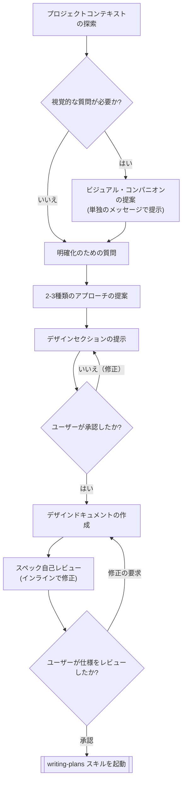

# アイデアをデザインに落とし込む

自然な対話を通じて、アイデアを完全に形成されたデザインと仕様に変換します。

まず現在のプロジェクトコンテキストを理解し、アイデアを洗練させるために質問を一つずつ投げかけます。構築する内容を理解したら、デザインを提示し、ユーザーの承認を得ます。

<HARD-GATE>
デザインを提示し、ユーザーがそれを承認するまで、いかなる実装スキル（setup-react-project, mcp-builder など）の起動、コードの記述、プロジェクトの雛形作成、または実装アクションを行ってはなりません。これは、プロジェクトの単純さにかかわらず、すべてのプロジェクトに適用されます。
</HARD-GATE>

## アンチパターン: 「単純すぎてデザインは不要だ」

すべてのプロジェクトはこのプロセスを経る必要があります。ToDo リスト、単一機能のユーティリティ、設定変更 —— そのすべてです。「単純な」プロジェクトこそ、検証されていない前提条件が最も多くの無駄な作業を引き起こす場所です。デザインは短くても構いません（本当に単純なプロジェクトなら数行で十分です）が、必ず提示して承認を得なければなりません。

## チェックリスト

以下の各項目について、**必ずタスク（todo.mjs 等）を作成し、順番に完了させる必要があります。**

1. **プロジェクトコンテキストの探索** — ファイル、ドキュメント、最近のコミットを確認する
2. **ビジュアル・コンパニオンの提案** (視覚的な質問が含まれる場合) — これは他の質問と混ぜず、単独のメッセージで行う。下の「ビジュアル・コンパニオン」セクションを参照。
3. **明確化のための質問** — 一度に一つずつ、目的・制約・成功基準を理解する
4. **2-3種類のアプローチの提案** — トレードオフと推奨案を提示する
5. **デザインの提示** — 複雑さに応じてセクション分けし、各セクションごとにユーザーの承認を得る
6. **デザインドキュメントの作成** — `docs/plans/YYYY-MM-DD-<topic>-design.md` に保存し、コミットする
7. **スペック自己レビュー** — プレースホルダ、矛盾、曖昧さ、スコープの迅速なインラインチェック（後述）
8. **ユーザーによるレビュー** — 次に進む前に、ユーザーに作成した仕様書ファイルをレビューしてもらう
9. **実装への移行** — `writing-plans` スキルを起動して、詳細な実装計画を作成する

## プロセスフロー

**最終的な状態は `writing-plans` の起動です。** 他の実装スキルを起動しないでください。ブレインストーミングの後に起動する唯一のスキルは `writing-plans` です。

## プロセス詳細

**アイデアの理解:**

- まず現在のプロジェクトの状態（ファイル、ドキュメント、最近のコミット）を確認してください。
- 詳細な質問を始める前に、スコープを評価してください。要求が複数の独立したサブシステム（例：「チャット、ストレージ、請求、分析を備えたプラットフォーム」）を含んでいる場合は、直ちにその旨を伝えてください。分解が必要なプロジェクトに対して、詳細を詰めることに時間を費やさないでください。
- プロジェクトが単一の仕様に対して大きすぎる場合は、サブプロジェクトへの分解を支援してください。独立した部分は何か、それらはどのように関連するか、どの順番で構築すべきか。その後、最初のサブプロジェクトを通常のデザインフローで進めます。各サブプロジェクトは、独自の「仕様 → 計画 → 実装」サイクルを持ちます。
- 適切なスコープのプロジェクトについては、アイデアを洗練させるために一つずつ質問を投げかけます。
- 可能であれば多肢選択式の質問を優先しますが、自由回答形式でも構いません。
- 1つのメッセージにつき質問は1つだけにしてください。特定のトピックがより深い探求を必要とする場合は、複数の質問に分割します。
- 目的、制約、成功基準を理解することに焦点を当ててください。

**アプローチの探求:**

- トレードオフを伴う 2-3 種類のアプローチを提案してください。
- 推奨オプションとその理由を添えて、対話形式でオプションを提示してください。
- 推奨するオプションを最初に提示し、その理由を説明してください。

**デザインの提示:**

- 何を構築するか理解できたと確信したら、デザインを提示してください。
- 複雑さに応じてセクションの規模を調整してください。単純なら数行、ニュアンスが必要なら 200-300 語程度にします。
- 各セクションの後に、ここまでの内容が正しいか確認してください。
- アーキテクチャ、コンポーネント、データフロー、エラーハンドリング、テストをカバーしてください。
- 理解できない点があれば、立ち戻って明確化する準備をしてください。

**隔離と明確さのための設計:**

- システムを、それぞれが 1 つの明確な目的を持ち、定義されたインターフェースを通じて通信し、独立して理解・テストできる小さなユニットに分解してください。
- 各ユニットについて、以下の問いに答えられるようにします：それは何をするのか、どう使うのか、何に依存しているのか。
- 内部の実装を読まずに、そのユニットが何をするか理解できますか？ 内部を変更しても消費者を壊さずに済みますか？ そうでないなら、境界線の引き方に改善の余地があります。
- 小さく、境界が明確なユニットは、AI にとっても扱いやすいものです。一度にコンテキストに保持できるコードの方が推論しやすく、ファイルが集中していれば編集の信頼性も高まります。ファイルが大きくなりすぎたときは、多くのことをやりすぎているシグナルです。

**既存のコードベースでの作業:**

- 変更を提案する前に、現在の構造を探索してください。既存のパターンに従ってください。
- 既存のコードに、作業に影響を与える問題（例：巨大化したファイル、不明瞭な境界、絡み合った責務）がある場合は、良い開発者が自分の作業範囲でコードを改善するように、ターゲットを絞った改善をデザインの一部に含めてください。
- 無関係なリファクタリングを提案しないでください。現在の目標に資することに集中してください。

## デザインの後

**ドキュメント化:**

- 検証済みのデザイン（仕様）を `docs/plans/YYYY-MM-DD-<topic>-design.md` に書き込んでください。
- （ユーザーが仕様書の保存場所を別途指定している場合は、そちらを優先してください）
- デザインドキュメントを Git にコミットしてください。

**スペック自己レビュー:**
仕様書を作成した後、新鮮な目でそれを見直してください：

1. **プレースホルダのスキャン**: "TBD"、"TODO"、未完了のセクション、または曖昧な要件はありませんか？ それらを修正してください。
2. **内部の一貫性**: セクション間に矛盾はありませんか？ アーキテクチャは機能説明と一致していますか？
3. **スコープチェック**: これは単一の実装計画に対して十分に焦点が絞られていますか、それとも分解が必要ですか？
4. **曖昧さのチェック**: 要件が 2 通りに解釈される可能性はありませんか？ その場合は、1 つを選んで明示的にしてください。

問題があればインラインで修正してください。再レビューは不要です。修正して次に進んでください。

詳細なチェックを行う場合は、補助プロンプトを確認してください：
`skills/brainstorming/spec-document-reviewer-prompt.md`

**ユーザーレビューゲート:**
自己レビューのループを通過したら、次に進む前にユーザーに仕様書のレビューを求めてください：

> 「仕様書を作成し、`<path>` にコミットしました。実装計画の作成を開始する前に、内容を確認し、修正したい点がないか教えてください。」

ユーザーの返答を待ちます。修正の要求があれば対応し、自己レビューのループを再実行します。ユーザーの承認が得られたら、次に進みます。

**実装:**

- `writing-plans` スキルを起動して、詳細な実装計画を作成してください。
- **他のスキルを起動しないでください。** `writing-plans` が次のステップです。

## 重要な原則

- **一度に一つの質問** - 複数の質問で圧倒しない
- **多肢選択を優先** - 自由回答よりも答えやすい
- **YAGNI を徹底** - すべてのデザインから不要な機能を削ぎ落とす
- **代替案を探求** - 結論を出す前に常に 2-3 種類のアプローチを提案する
- **段階的な検証** - デザインを提示し、承認を得てから次に進む
- **柔軟に対応** - 意味が通じない場合は立ち戻って明確化する

## ビジュアル・コンパニオン

ブレインストーミング中にモックアップ、図解、視覚的なオプションを表示するためのブラウザベースのコンパニオンです。これはツールとして利用可能であり、モードではありません。コンパニオンを受け入れることは、視覚的な説明が役立つ質問に利用できることを意味します。すべての質問がブラウザを経由するわけではありません。

**コンパニオンの提案:** 今後の質問に視覚的な内容（モックアップ、レイアウト、図解）が含まれると予想される場合、同意を得るために一度だけ提案してください：
> 「現在取り組んでいる内容の一部は、ウェブブラウザで視覚的に説明したほうが分かりやすいかもしれません。進行に合わせてモックアップ、図、比較資料などのビジュアルをまとめることができます。この機能はまだ新しく、トークンを多く消費する可能性があります。試してみますか？（ローカルURLを開く必要があります）」

**この提案は、必ず単独のメッセージで行わなければなりません。** 明確化のための質問、コンテキストの要約、その他の内容と混ぜないでください。メッセージには上記の提案のみを含め、他には何も含めないでください。ユーザーの返答を待ってから続行してください。拒否された場合は、テキストのみでブレインストーミングを続けます。

**質問ごとの判断:** ユーザーが承諾した後も、**各質問について**ブラウザを使うかターミナルを使うかを判断してください。基準は：**「ユーザーはこれを読むよりも見るほうが理解しやすいか？」**です。

- **ブラウザを使用するケース**: ビジュアルそのものの内容 —— モックアップ、ワイヤーフレーム、レイアウト比較、アーキテクチャ図、並べたデザイン案
- **ターミナルを使用するケース**: テキストの内容 —— 要件の質問、概念的な選択、トレードオフのリスト、A/B/C/D のテキストオプション、スコープの決定

UI に関するトピックの質問が、自動的に視覚的な質問になるわけではありません。「このコンテキストにおける『パーソナリティ』とは何を意味しますか？」は概念的な質問であり、ターミナルを使用します。「どのウィザードのレイアウトがより適していますか？」は視覚的な質問であり、ブラウザを使用します。

同意が得られた場合は、続行する前に詳細ガイドとツールパスを確認してください：
`skills/brainstorming/visual-companion.md`
(ツール: `skills/brainstorming/scripts/start-server.sh`)
