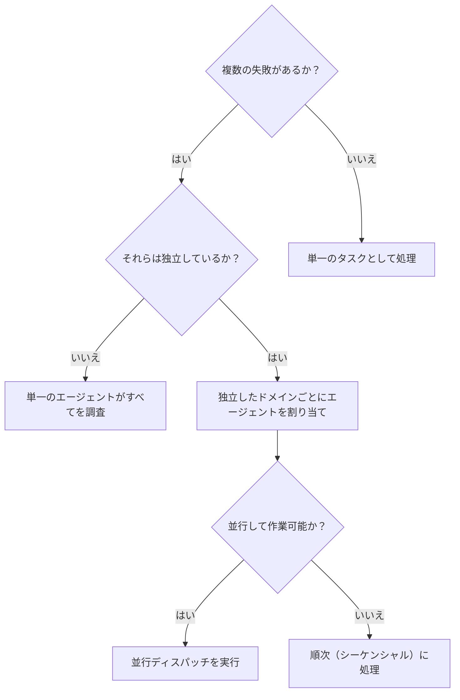

# 並行エージェントのディスパッチ (Dispatching Parallel Agents)

## 概要

複数の無関係な失敗（異なるテストファイル、異なるサブシステム、異なるバグ）が発生している場合、それらを順次調査するのは時間の無駄です。それぞれの調査は独立しており、並行して進めることができます。

**コア原則:** 独立した問題ドメインごとに1つのエージェント（またはタスク）を割り当て、並行して作業を進行させる。

## 使用タイミング



**使用すべきケース:**
- 異なる根本原因を持つ3つ以上のテストファイルが失敗している。
- 複数のサブシステムが独立して破損している。
- 各問題を、他の問題のコンテキストなしで理解できる。
- 調査間に共有状態（副作用の競合）がない。

**使用すべきでないケース:**
- 失敗が関連している（1つを直せば他も直る可能性がある）。
- システム全体のフルコンテキストを理解する必要がある。
- 探索的なデバッグ（何が壊れているかまだ分からない）。
- エージェント同士が干渉する可能性がある（同じファイルを編集する、同じリソースを使用するなど）。

## Gemini CLI での実現方法

Gemini CLI 自体はシングルスレッドですが、以下の手法で「並行性」を実現できます。

1. **マルチ・ワークツリー戦略 (Human-driven Parallelism):**
   - `using-git-worktrees` を使い、問題ごとに独立したワークツリーを作成します。
   - 複数のターミナルを開き、それぞれのワークツリーで Gemini CLI を起動して、独立した課題を同時に依頼します。
2. **バックグラウンド実行:**
   - `run_shell_command` の `is_background: true` を使用し、長時間実行されるテストやビルドをバックグラウンドで走らせます。その間に AI エージェントは別の調査を進めることができます。
3. **論理的並行:**
   - `subagent-driven-development` と組み合わせ、巨大な課題を「独立したサブタスク」に分割します。

## パターン

### 1. 独立したドメインの特定

何が壊れているかに基づいて失敗をグループ化します。
- ファイルAのテスト: ツール承認フロー
- ファイルBのテスト: バッチ完了動作
- ファイルCのテスト: 中断（Abort）機能

各ドメインは独立しています。

### 2. フォーカスしたタスクの作成

各タスク（各エージェントまたは各ワークツリー）に含めるべき内容:
- **具体的なスコープ:** 1つのテストファイルまたは1つのサブシステム。
- **明確なゴール:** 対象のテストをパスさせる。
- **制約:** 他のコードは変更しない。
- **期待される出力:** 発見したことと修正した内容の要約。

### 3. 並行実行と統合

タスクが完了したら:
- 各要約を確認し、修正が互いに競合していないか検証する。
- フルテストスイートを実行する。
- すべての変更を統合する。

## エージェント・プロンプトの構造

優れたエージェントプロンプトの条件：
1. **フォーカスしている** - 1つの明確な問題ドメインに限定する。
2. **自己完結している** - 問題を理解するために必要なコンテキスト（エラーメッセージなど）をすべて含める。
3. **出力が具体的** - エージェントが何を返すべきか（調査結果、修正の要約）を明確に指定する。

### 例（個別のワークツリーやサブエージェントへの依頼）：
```markdown
src/agents/agent-tool-abort.test.ts にある3つの失敗しているテストを修正してください:

1. "should abort tool with partial output capture" - メッセージに 'interrupted at' を期待している。
2. "should handle mixed completed and aborted tools" - 完了すべき高速ツールが中断されている。
3. "should properly track pendingToolCount" - 3つの結果を期待しているが 0 になっている。

これらはタイミングやレースコンディション（競合状態）の問題です。あなたのタスク:

1. テストファイルを読み、各テストが何を検証しているか理解する。
2. 根本原因を特定する。単にタイムアウトを増やすのではなく、イベントベースの待機に置き換えるなど、根本的な修正を行ってください。
3. 修正し、何を発見し、何を修正したかの要約を返してください。

本番コードへの変更は、バグ修正に必要な最小限に留めてください。
```

## よくある間違い

**❌ 範囲が広すぎる:** 「すべてのテストを直して」 → エージェントが迷子になります。
**✅ 具体的:** 「agent-tool-abort.test.ts を修正して」 → スコープが明確です。

**❌ コンテキスト不足:** 「レースコンディションを直して」 → エージェントはどこから手をつければいいか分かりません。
**✅ 具体的な情報:** エラーメッセージやテスト名を提示します。

**❌ 制約がない:** エージェントが必要以上のリファクタリングを行ってしまう可能性があります。
**✅ 制約の明示:** 「本番コードは変更せず、テストのみを修正して」などの指示を与えます。

**❌ 出力が曖昧:** 「直して」だけでは、何が変更されたか把握できません。
**✅ 出力の指定:** 「根本原因と変更内容の要約を返して」と指定します。

## セッションからの具体的な実例

**シナリオ:** 大規模なリファクタリング後に、3つのファイルにまたがって6つのテスト失敗が発生。

**失敗の内訳:**
- `agent-tool-abort.test.ts`: 3つの失敗（タイミングの問題）
- `batch-completion-behavior.test.ts`: 2つの失敗（ツールが実行されていない）
- `tool-approval-race-conditions.test.ts`: 1つの失敗（実行数が 0）

**意思決定:** これらは独立したドメインであると判断。中断ロジック、一括完了動作、承認のレースコンディションはそれぞれ別個の問題。

**ディスパッチ:**
```
エージェント 1 → agent-tool-abort.test.ts を修正
エージェント 2 → batch-completion-behavior.test.ts を修正
エージェント 3 → tool-approval-race-conditions.test.ts を修正
```

**結果:**
- エージェント 1: タイムアウトをイベントベースの待機に置き換え。
- エージェント 2: イベント構造のバグ（`threadId` の位置が誤っていた）を修正。
- エージェント 3: 非同期ツール実行の完了を待機する処理を追加。

**統合:** すべての修正は独立しており、競合は発生しなかった。フルテストスイートを実行し、すべてがパスすることを確認。

**短縮された時間:** 3つの問題を順次処理するのではなく、並行して解決できたことで、およそ1/3の時間で解決に成功。


## 検証 (Verification)

各タスク（エージェント）が完了した後のチェックリスト：
1. **各要約の確認** - 何が変更されたかを正確に理解する。
2. **競合のチェック** - 複数のタスクが同じファイルを編集していないか、論理的に矛盾していないか。
3. **フルスイートの実行** - すべての修正が統合された状態で、システム全体が正常かを確認。
4. **スポットチェック** - AI は時にシステム的な誤りを犯すことがあるため、主要な修正箇所を自分の目で確認する。

## 主な利点

1. **並列化 (Parallelization)** - 複数の調査を同時に進めることができる（マルチターミナルやワークツリーを活用）。
2. **フォーカス (Focus)** - 各タスクのスコープを限定することで、追跡すべきコンテキストが少なくて済む。
3. **独立性 (Independence)** - 各エージェントが独立して動くため、互いの作業を邪魔しない。
4. **スピード (Speed)** - 複数の問題を一度に解決し、開発サイクルを高速化できる。
