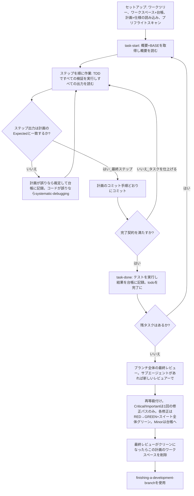

# 計画の実行 (Executing Plans)

このセッションで計画を自分でタスクごとに実行します。タスクごとの実装者サブエージェントも、タスクごとのレビュアーもありません。最後にブランチ全体を1回、新鮮なコンテキストでレビューします。

**なぜインラインか:** サブエージェント駆動開発は、タスクごとに新しい実装者と新しいレビュアー（いずれもコードベースをゼロから読み直す）のコストを払います。インライン実行が払うのは1つのコンテキスト（あなた自身）と最後のレビュアー1件分です。失うのは、タスクごとの新鮮なコンテキストとタスクごとのもう一組の目です。このスキルは、その2つがもたらしていたものを別の手段で保持します。概要（brief）が仕様、台帳（ledger）が記憶、TDD がタスクごとのゲート、最終レビュアーがもう一組の目です。

**コア原則:** 計画は既に思考を終えています。正確に実行し、各ステップを「失敗を目撃してからパスした」テストで証明し、自分の忘却を生き延びる記録を残します。

**ナレーション (Narration):** ツール呼び出しの間、ナレーションは高々1行の短い文で行います — 台帳とツールの実行結果が記録を保持します。

**継続実行 (Continuous execution):** タスク間で人間パートナーへの確認のために一時停止しないでください。パートナーがインライン実行を選んだのはコストを抑えるためであり、タスクごとに「続行すべきですか？」と聞かれるためではありません。計画のすべてのタスクを停止せずに実行します。

**裁定し、停滞しない (Rulings, not stalls)。** 矛盾、曖昧さ、計画の欠陥 — それらは決定します。仕様が拘束力のある権威、計画はその議論であり、どちらも答えないものはあなたの判断が決めます。すべての決定を台帳に `Ruling: <決定内容> — <理由> — <誤った場合のコスト>` として記録し、続行します。台帳に記録されない計画からの逸脱は、密かに下された決定です。

あなたを止めるのは次の4つのみです。それ以外は止めません。不可逆または破壊的な操作。セキュリティに敏感なアクション。このワークツリーの外への副作用で、慣習上まず確認すべきもの（マージ、共有ブランチへのプッシュ、公開）。そして、どの前進路も推測に等しいほど壊れた計画。それらに該当したら停止して質問します。

## いつ使用するか

- `writing-plans` による計画があり、人間パートナーが引き渡し時にインライン実行を選んだ。
- ハーネスにサブエージェントツールがない（`../using-superpowers/references/` のプラットフォーム別リファレンスを参照）。派遣を捏造してはなりません。ここで計画を実行します。
- タスクがほぼ独立している — `subagent-driven-development` と同じ前提条件。

完全に具体化された計画のもとでは、インライン実行は書き写しとテストです。ミッドティアのセッションモデルでも十分に動作し、最上位モデルがコストに見合う唯一の場所は最終レビューであり、このスキルはそれを別途ディスパッチします。インラインを選ぶ際は人間パートナーにその旨を伝えます。

タスクごとにレビューゲートを求める場合、または計画が長く後半タスクが圧縮されたコンテキストで実行されそうな場合は、`subagent-driven-development` を優先します。長い計画に対するインライン実行も動作します — 台帳が回復可能性を担保します — が、後半のタスクほどあなたのリソースは目減りします。

## プロセス (The Process)



## セットアップ (Setup)

隔離されたワークスペースで作業が行われることを確保します。`using-git-worktrees` を使用して作成するか、既存のものを確認します。人間パートナーの明示的な同意なしに、`main`/`master` ブランチで直接実装を開始してはなりません。

会話のメモリはコンテキスト圧縮を生き延びません。位置を見失ったインライン実行者は、コミットが既に存在するタスクを再実装してしまいます — コントローラーがタスクを再ディスパッチする失敗と同じであり、自分のコンテキストで代金を払うことになります。todo だけでなく、**台帳ファイル (ledger file)** で進捗を追跡します。ハーネスの todo はライブビューであり、台帳が記録です。

ワークスペースと台帳は `subagent-driven-development` と共有です — 同じディレクトリ、同じ形式 — そのため計画は途中で実行者を変更でき、新しい実行者は同じ台帳から再開します。

- 各計画はワークスペースを持ちます。スキル開始時に `bash ../subagent-driven-development/scripts/sdd-workspace PLAN_FILE` を実行します。計画の git-ignore されたディレクトリ（`<repo-root>/.superpowers/sdd/<plan-basename>/`）が出力されます。この計画のすべての成果物（台帳、概要、レビューパッケージ）の置き場です。他の計画のディレクトリを読み書きしてはなりません。
- `<workspace>/progress.md` にこの計画の台帳があるか確認します。1行目があなたの計画ファイルを指名しており、`Task <N>: complete` 行のあるタスクは完了 (DONE) です — やり直さないこと。最初の未完了タスクから再開します。それらのコミットは、あなたのコンテキストが作成を覚えていなくても git に存在します。圧縮後は自分の記憶より台帳と `git log` を信頼します。1行目が別の計画ファイルを指名する台帳は、別の計画の進捗です。触れずに自分のものを新規作成します。
- 台帳は1行目を識別子として作成します。`# SDD ledger — plan: <plan file path>`。
- `git clean -fdx` はワークスペースを破壊します（git-ignore されたスクラッチ領域のため）。その場合は `git log` から回復します。

計画を1度読み、コンテキストとグローバル制約を把握し、タスクごとに todo を作成します。計画が仕様 (Spec) を指名している場合はそれも読みます。仕様は計画が議論する権威であり、計画内部の矛盾は仕様に照らして解決します。到達可能な仕様がない計画は、その旨を台帳に記録します — 仕様なしの裁定は暫定的です。

**必須サブスキル:** タスク1の前に `test-driven-development` を起動します。以降のすべてのタスクのすべてのステップを支配します。計画のステップに「失敗するテストを先に書く」と書いてあっても、読む義務は免除されません。

タスク1の前に、計画のタスク間矛盾をスキャンします。計画の Interfaces ブロックが手がかりです。以前のタスクが生産するものを消費するタスクごとに1行を台帳に記録します — 2つのタスク、何が生産され何が消費されるか、何を発見したか。何も共有しないタスクに行は不要です。何も共有しない計画には `Pre-flight: no shared interfaces` の1行を記録します。行が浮かび上がらせた矛盾は、仕様を拘束力のある権威として裁定し、その行の脇に記録してからタスク1を開始します。各タスク固有の記述は概要を読むときに確認します。ここでは行いません。

## タスクループ (The Task Loop)

あなたが出力するすべて、すべてのツール結果は、セッションの残り時間コンテキストに残留します。長いテスト出力はワークスペース内のファイルにリダイレクトして末尾だけ読みます。計画全体ではなく概要 (brief) を読みます。

### 1. タスクの取得

- このスキルの `bash scripts/task-start PLAN_FILE N` を実行します。概要ファイルのパスと BASE（タスクのレビュー範囲を切り出す起点コミット）を1回の呼び出しで出力します。セットアップ時に覚えているタスクも含め、すべてのタスクで概要を読みます。覚えているのは要約であり、概要には正確な値、シグネチャ、テストケースがあります。
- タスクの todo を in_progress にします。

ツール呼び出し1回はコンテキスト全体を読み直す1ターンです。記録作業は作業に相乗りさせます — 台帳への追記はコミットと同じ呼び出しで行い、単独の呼び出しにはしません。

### 2. ステップの作業

計画のステップは既に RED-GREEN 順に並んでいます。セットアップ時に起動した `test-driven-development` のもと、その順序で従います。テストステップのコードは先に書き、先に実行します。失敗を目撃することはステップであり、形式ではありません — 実装が存在する前にパスするテストは、テストについての発見です。

コマンドを実行するステップにはすべて `Expected:` 行があります。コマンドを実行し、出力を読み、比較します。結果は3通りです。

- **一致。** 次のステップへ。
- **コードが誤り。** `systematic-debugging` を使用します。原因を見つけます。ステップの出力に合わせるための症状へのパッチは決して当てません。
- **計画が誤り** — ステップが仕様と矛盾する、以前のタスクのインターフェースがこのタスクの消費と一致しない、動作し得ないコマンド。仕様を満たす最小の変更を裁定し、`Task <N>: Ruling: <発見> — <決定内容と理由>` として台帳に記録して続行します。裁定は運ばれるものであり、記憶されるものではありません。同じインターフェースに触れる後続タスクは台帳から読みます。

計画のコミット手順どおりにコミットします。複数コミットにまたがるタスクは問題ありません。BASE はレビュー範囲を切り出す起点であり、`HEAD~1` では決してありません。

### 3. 完了契約

タスクの台帳行を記録する前に、以下がすべて真実であり、このセッション内の証拠に裏付けられています — diff が正しそうに見えることからの推測ではありません。

- 概要が指名するすべてのテストがこのタスク内に存在し実行され、出力を読んだ。
- タスクの最終テスト実行がパスした — `task-done` がその実行であり、コマンドと結果を台帳行に書き込む。
- 概要内のすべての `Expected:` 行を実際の出力と比較した。
- 概要からのすべての逸脱に台帳内の `Ruling:` 行がある。

**必須サブスキル:** 主張には `verification-before-completion` が適用されます。1つでも欠ければタスクは未完了です。仕上げます。

### 4. タスクの完了

このスキルの `bash scripts/task-done PLAN_FILE N BASE -- <test command>` を、概要がタスク全体に指名するテストコマンドとともに実行します。テストを実行し、全出力をワークスペースに保持し、末尾を出力し、パスした場合のみ完了行を台帳に追記します。

`Task <N>: complete (commits <base7>..<head7>, tests: <command> → <result>)`

失敗した実行は何も記録しません。タスクは未完了です。記録されたら todo を完了にして次のタスクに進みます。

## 最終レビュー (Final Review)

`bash ../subagent-driven-development/scripts/review-package PLAN_FILE MERGE_BASE HEAD` を実行します（MERGE_BASE = ブランチ開始コミット。例: `git merge-base main HEAD`）。出力されたファイルを読んでレビューします。

**サブエージェントツールがある場合:** 利用可能な最上位モデルでレビュアーをディスパッチします — ブランチ全体のレビューは判断タスクです。`requesting-code-review` の [code-reviewer.md](../requesting-code-review/code-reviewer.md) を使用し、パッケージパス、計画と仕様のパス、計画に Review Focus セクションがあれば原文のまま（計画のテストが行使しない入力クラスと失敗モード — レビュアーは各項目を意図的に確認します）、および台帳の `Ruling:` 行へのポインタを渡して、あなたが行った判断を吟味できるようにします。モデルは明示的に指定します。省略するとセッションのモデルが継承され、最上位でない場合があります。この実行全体で買う唯一の新鮮なコンテキストです。スキップしてはなりません。自分の diff 読みで代替してもなりません。

**サブエージェントツールがない場合:** code-reviewer.md を読んで、最後のタスクの台帳行の後に別のパスとして自分でそのレビューを行います。台帳に `Final review: self-review (no subagent tool)` と書き、最終メッセージでもその旨を伝えます。作成者自身の自己レビューは新鮮なレビュアーより弱く、マージ前にそれで十分かは人間パートナーが判断します。

対応する前に指摘事項を仕分けます。レビュアーの深刻度ラベルは助言であり、ゲートはあなたが決めます。「Declined to judge」リストもあなたのものです。そこにある各行は、計画矛盾とまったく同じ裁定を行い台帳に記録します — `Final: Ruling: <レビュアーが脇に置いた挙動> — <このソフトウェアを使う合理的な人物が得るもの、およびそれが立つ理由または指摘になる理由> — <誤った場合のコスト>`。まず効果で再等級付けします。仕様はビジョンドキュメントであり、指摘の等級は仕様がトリガーを指名しているかどうかではなく、出荷された場合に合理的な人物が得るもので決まります — 仕様の沈黙を理由に Minor としたレビュアーは、効果ではなく仕様を等級付けしています。次に:

- **Critical と Important** は修正パスに入ります。
- **Minor** は `Final: minor (deferred): <1行>` として台帳に記録し、最終メッセージの「Deferred minors」に記載します。Minor が修正パスに入ることは決してなく、裁定になることもありません — 裁定は矛盾についての決定であり、磨き提案を辞退したメモではありません。

Critical と Important の指摘は自分で修正します — ここではあなたが実装者です — **1回**のパスで。各修正は第2のレビュアーではなく TDD で検証します。指摘を再現するテストを書き、失敗を目撃し、パスさせ、スイート全体を実行します。各件を `Final: fixed <指摘> — <テスト名> RED→GREEN, suite <N>/<N>` として台帳に記録します。先に失敗したテストのない修正は検証されていません。パス後にスイートがグリーンでなければパスは終わっていません。再レビューはディスパッチしません。カバーするテストが「対応済み」に、スイート実行が「破壊なし」に既に答えている diff を読み直すだけだからです。

修正しないと決めた指摘は裁定です — `Final: Ruling: <指摘> — <コードが立つ理由> — <誤った場合のコスト>` — 裁定リストで人間パートナーに届きます。第2の修正パスはありません。

## 完了 (Finish)

何かを削除する前に、台帳内の `Ruling:` を含むすべての行を、作成順に「Rulings I made」として最終メッセージに集めます。各行に誤った場合のコストを添え、すべての `minor (deferred)` 行を「Deferred minors」に集めます。両リストは完全網羅です。最終メッセージは、人間パートナーに代わって下した決定と、対応しなかった指摘が届く唯一の場所です。

最終レビューがクリーンになり修正がコミットされたら、この計画のワークスペースディレクトリを削除します — 記録は git 履歴に引き継がれます。兄弟ディレクトリは他の計画のものです。触れません。

`finishing-a-development-branch` を使用します。

## 自己正当化の防止 (Common Rationalizations)

| 言い訳 | 現実 |
|--------|---------|
| 「タスクNの内容は覚えている」 | 覚えているのは要約です。概要には正確な値があります。読みます。 |
| 「計画のコードは正しい、テストの失敗を見るのはスキップ」 | 失敗を見ていないテストは何も証明しません。それは1つのステップです。実行します。 |
| 「ステップごとではなく最後に全スイートを実行する」 | どのステップが壊したかを知るのがステップごとの実行です。タスク末の実行は契約であり、代替ではありません。 |
| 「計画はここが誤り、自分で正しいことをする」 | 正しいことをして裁定を台帳に記録します。記録されない逸脱は密かな決定です。 |
| 「台帳行は数タスク分まとめて書く」 | 圧縮は都合の良い瞬間を待ちません。コミットと同じメッセージで1タスク1行です。 |
| 「次のタスクの前に確認を取る」 | パートナーはコストを抑えるためにインラインを選びました。進捗の促しは相手の時間を消費します。止めるのは4条件のみです。 |
| 「自分の diff は丁寧に読んだ、最終レビューは冗長」 | 同じ作成者、同じ盲点です。レビュアーはこの実行が買う唯一の新鮮なコンテキストです。 |
| 「変更は自明、テストは通るはず」 | 「はず」は証拠ではありません。契約はコマンドとその出力を要求します。 |
| 「サブエージェントは遅く高価、最終レビューもスキップ」 | インラインは既にタスクごとのレビューを除去しました。ブランチ全体の1回のレビューは下限であり上限ではありません。 |
| 「レビュアーが Minor と言った、だから Minor」 | そのラベルは仕様の沈黙を等級付けしました。人物が得るものを等級付けします。再等級付けしてからゲートを通します。 |
| 「修正は自明、失敗するテストは不要」 | 失敗するテストだけが、指摘が実在し解消したことの証明です。それがなければ diff と希望だけです。 |
| 「ついでに Minor も直す」 | 直す Minor 1件ごとに、パートナーが求めていないテスト・修正・スイート実行が増えます。台帳に記録します。判断はパートナーです。 |

## 実行例 (Example Workflow)

```
あなた: この計画をインラインで実装するために `executing-plans` スキルを使用します。

[セットアップ: ワークツリー確認]
[計画を1度読む: docs/plans/feature-plan.md。仕様も読む]
[ワークスペース解決: sdd-workspace docs/plans/feature-plan.md — 台帳なし、新規開始]
[プリフライトスキャン: 共有インターフェース2行、自己整合性4行、クリーン。台帳に記録]
[全タスクの todo を作成]

タスク 1: フックのインストールスクリプト

[task-start plan 1 → 概要を読む。BASE a1b2c3d]
[ステップ1: 失敗するテストを書く — 記述]
[ステップ2: 実行 — FAIL: install_hook not defined。Expected と一致]
[ステップ3: 実装 — 記述]
[ステップ4: 実行 — PASS 1/1。Expected と一致]
[ステップ5: コミット — d4e5f6a]
[契約: テスト実行・出力確認済み、逸脱なし]
[task-done plan 1 a1b2c3d -- npm test -- hooks → 台帳: Task 1: complete (commits a1b2c3d..d4e5f6a, tests: npm test -- hooks → 1/1 pass)]

タスク 2: リカバリモード

[task-start plan 2 → 概要を読む。BASE d4e5f6a]
[ステップ2: 失敗するテストを実行 — FAIL。ただし import エラー: タスク1は installHook を export、概要は install_hook を消費]
[Ruling: 概要の消費名はタスク1の Produces ブロックに対する typo。installHook を使用 — 台帳: Task 2: Ruling: install_hook → installHook — タスク1 Produces と一致 — 誤った場合のコスト: リネーム1件]
[ステップ2-5は計画どおり。コミット b7c8d9e]
[task-done plan 2 d4e5f6a -- npm test -- recovery → 台帳: Task 2: complete (commits d4e5f6a..b7c8d9e, tests: npm test -- recovery → 8/8 pass)]

...

[全タスク後: review-package plan MERGE_BASE HEAD。code-reviewer を最上位モデルでディスパッチ]
レビュアー: Important 1件 — 進捗レポート間隔がハードコード。Minor 2件。
[再等級付け: Important は維持。Minor は deferred として台帳へ]
[修正パス: test_progress_interval_configurable RED → PROGRESS_INTERVAL 抽出 → GREEN。スイート 12/12。コミット]
[台帳: Final: fixed hardcoded interval — test_progress_interval_configurable RED→GREEN, suite 12/12]

Rulings I made:
- タスク2: install_hook → installHook（概要の typo。誤った場合のコスト: リネーム1件）

Deferred minors:
- README に使用例がない
- recovery.js は verify/repair の2ファイルに分割できる

[この計画のワークスペースを削除 — 記録は git に引き継がれた]

`finishing-a-development-branch` を使用します。
```
