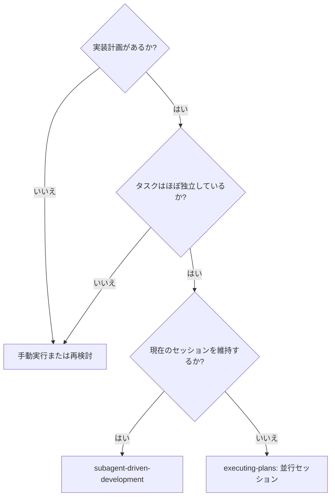
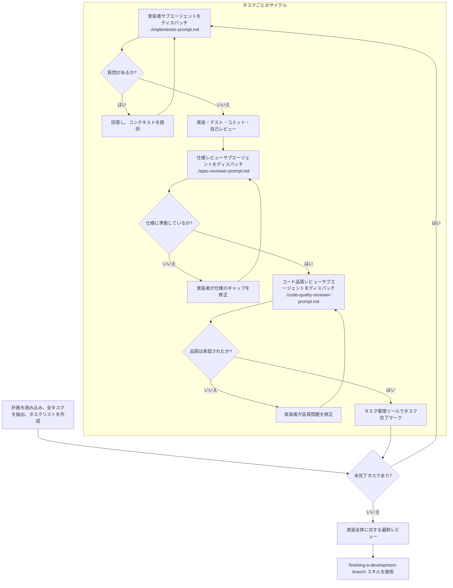

# Subagent-Driven Development

各タスクごとに新鮮な視点（サブエージェント）をディスパッチして計画を実行し、各タスク完了後に「仕様準拠レビュー」と「コード品質レビュー」の2段階レビューを行います。

**なぜサブエージェントなのか:** 隔離されたコンテキストを持つ専門エージェントにタスクを委任することで、指示とコンテキストを正確に構成し、タスクの成功を確実にします。サブエージェントはあなたのセッションのコンテキストや履歴を継承すべきではなく、必要なものだけを構築して提供します。これにより、あなた自身のコンテキストを調整作業のために温存することもできます。

**中心原則:** タスクごとの新鮮なサブエージェント + 2段階レビュー (仕様、次に品質) = 高品質と迅速なイテレーション

**継続実行の規律:** タスクの間でユーザー（人間）の手を煩わせないでください。計画にあるすべてのタスクを、停止することなく最後まで実行し続けてください。停止して良いのは以下の理由のみです：自力で解決できない BLOCKED ステータス、進行を真に妨げる曖昧さ、またはすべてのタスクが完了した時。「続けてもいいですか？」という確認や、過度な進捗サマリーは不要です。ユーザーはあなたに計画の実行を依頼したのですから、最後までやり遂げてください。

## 使用時期 (When to Use)



**executing-plans (並行セッション) との比較:**
- 同一セッション (コンテキストの切り替えなし)
- タスクごとに新鮮なサブエージェント (コンテキスト汚染なし)
- 各タスク後に2段階レビュー: 最初に仕様準拠、次にコード品質
- 迅速なイテレーション (タスク間に人間を介さない)

## プロセス (The Process)



**AIエージェントへの指示:** 以下のプロセスを厳密に実行してください。

### フェーズ 1: 準備

1.  **計画ファイルの特定:** ユーザーに実装計画が記述されたファイルのパスを尋ねてください。
2.  **計画の読み込みとタスクの抽出:** `read_file`ツールで計画ファイルを読み込み、実行すべき個別のタスクをすべて特定・抽出します。
3.  **タスクリストの作成:** 
    *   **Native-First**: Gemini CLI のビルトイン機能（`write_todos` 等）を優先して使用し、セッション中の進捗を管理します。
    *   **Fallback**: 3つ以上の独立したタスクがある場合や、永続化が必要な場合は、`scripts/todo.mjs` を併用して同期してください。
    *   **重要**: `scripts/todo.mjs` を使用する際は、必ず `show --json` で ID を確認してください。

## モデルの選択 (Model Selection)

コストを抑え速度を向上させるため、各役割に対して適切なモデルを使用してください。

- **機械的な実装タスク** (独立した関数、明確な仕様、1-2ファイル): 高速で安価なモデル（例: Gemini Flash）を使用してください。計画が十分に定義されていれば、ほとんどの実装タスクは機械的です。
- **統合と判断を要するタスク** (複数ファイルの調整、パターンマッチング、デバッグ): 標準的なモデルを使用してください。
- **アーキテクチャ、設計、およびレビュータスク**: 最も能力の高いモデル（例: Gemini Pro）を使用してください。

**タスクの複雑さのシグナル:**
- 1-2ファイルに触れ、完全な仕様がある → 安価なモデル
- 統合の懸念があり、複数のファイルに触れる → 標準的なモデル
- 設計上の判断や広範なコードベースの理解が必要 → 最も能力の高いモデル

## 実装者ステータスの管理 (Handling Implementer Status)

実装者サブエージェントは以下の4つのステータスのいずれかを報告します。適切に処理してください。

- **DONE:** 仕様準拠レビューに進んでください。
- **DONE_WITH_CONCERNS:** 実装は完了しましたが、疑問点が残っています。レビューに進む前に、その懸念事項を確認してください。懸念が正確性や範囲に関するものである場合は、レビューの前に対応してください。単なる観察（例：「このファイルが大きくなっています」）であれば、それをメモしてレビューに進んでください。
- **NEEDS_CONTEXT:** 提供されなかった情報が必要です。不足しているコンテキストを提供し、再度ディスパッチしてください。
- **BLOCKED:** タスクを完了できません。ブロック要因を評価してください：
    1. コンテキストの問題であれば、詳細を提供して同じモデルで再ディスパッチします。
    2. より高度な推論が必要な場合は、より能力の高いモデルで再ディスパッチします。
    3. タスクが大きすぎる場合は、より小さな断片に分割します。
    4. 計画自体が間違っている場合は、人間にエスカレーションします。

**決して**、実装者が「行き詰まった」と言っているのに、変更を加えずに同じモデルにリトライを強制しないでください。何らかの変更が必要です。

### フェーズ 2: タスク実行サイクル

ToDoリストの未完了タスクがなくなるまで、タスクごとに以下のサイクルを繰り返します。

1.  **次のタスクの特定:** 現在のタスクリストを確認し、次の未完了タスクを「実行中 (In Progress)」に更新します。
2.  **実装者 (Implementer) のディスパッチ:** `./implementer-prompt.md` を使用して実装サブエージェントを起動します。
3.  **仕様レビュー (Spec Reviewer) のディスパッチ:** `./spec-reviewer-prompt.md` を使用して仕様準拠レビューサブエージェントを起動します。
4.  **コード品質レビュー (Code Quality Reviewer) のディスパッチ:** `./code-quality-reviewer-prompt.md` を使用してコード品質レビューサブエージェントを起動します。
5.  **タスク完了:** 仕様レビューと品質レビューの両方で承認されたら、タスクを「完了 (Completed)」に更新します。

### フェーズ 3: 最終化

1.  **全タスク完了の確認:** すべてのタスクが完了（`[x]`）したことを確認します。
2.  **最終レビュー:** 全体の実装に矛盾がないか、統合上の問題がないかを確認します。
3.  **開発ブランチの完了:** `finishing-a-development-branch` スキルを起動し、最終作業を行ってください。

## プロンプトテンプレート (Prompt Templates)

-   `./implementer-prompt.md` - 実装者サブエージェントをディスパッチ
-   `./spec-reviewer-prompt.md` - 仕様準拠レビューアサブエージェントをディスパッチ
-   `./code-quality-reviewer-prompt.md` - コード品質レビューアサブエージェントをディスパッチ

## 例示ワークフロー

```
あなた: 私はこの計画を実行するためにサブエージェント駆動開発を使用しています。

[計画ファイルを一度読み込む: docs/plans/feature-plan.md]
[すべての5つのタスクを全文とコンテキストと共に抽出]
[すべてのタスクでTodoWriteを作成]

タスク 1: フックインストールスクリプト

[タスク 1 のテキストとコンテキストを取得 (既に抽出済み)]
[完全なタスクテキストとコンテキストで実装サブエージェントをディスパッチ]

実装者: 「開始する前に - フックはユーザーレベルまたはシステムレベルのどちらにインストールすべきですか？」

あなた: 「ユーザーレベル (~/.config/superpowers/hooks/)」

実装者: 「了解しました。今から実装します...」
[その後] 実装者:
  - インストールフックコマンドを実装
  - テストを追加、5/5 合格
  - 自己レビュー: --force フラグを見落としていたため追加
  - コミット済み

[仕様準拠レビューアをディスパッチ]
仕様レビューア: ✅ 仕様に準拠 - すべての要件を満たしており、余分なものなし

[Git SHA を取得し、コード品質レビューアをディスパッチ]
コードレビューア: 強み: 良好なテストカバレッジ、クリーン。問題点: なし。承認済み。

[タスク 1 を完了としてマーク]

タスク 2: 回復モード

[タスク 2 のテキストとコンテキストを取得 (既に抽出済み)]
[完全なタスクテキストとコンテキストで実装サブエージェントをディスパッチ]

実装者: [質問なし、続行]
実装者:
  - 検証/修復モードを追加
  - 8/8 テスト合格
  - 自己レビュー: 全て良好
  - コミット済み

[仕様準拠レビューアをディスパッチ]
仕様レビューア: ❌ 問題点:
  - 欠落: 進捗報告 (仕様では「100項目ごとに報告」と記載)
  - 余分: --json フラグを追加 (要求されていない)

[実装者が問題を修正]
実装者: --json フラグを削除、進捗報告を追加

[仕様レビューアが再レビュー]
仕様レビューア: ✅ 仕様に準拠

[コード品質レビューアをディスパッチ]
コードレビューア: 強み: 堅実。問題点 (重要): マジックナンバー (100)

[実装者が修正]
実装者: PROGRESS_INTERVAL 定数を抽出

[コードレビューアが再レビュー]
コードレビューア: ✅ 承認済み

[タスク 2 を完了としてマーク]

...

[すべてのタスク完了後]
[最終コードレビューアをディスパッチ]
最終レビューア: すべての要件を満たしています。マージ準備完了。

完了！
```

## 参考情報 (Reference)

## 利点 (Advantages)

**手動実行との比較:**
- サブエージェントは自然に TDD に従う
- タスクごとに新鮮なコンテキスト (混乱の防止)
- 並行安全 (サブエージェントは互いに干渉しない)
- サブエージェントは作業前および作業中に質問が可能

**Executing Plans との比較:**
- 同一セッション (ハンドオフの手間がない)
- 継続的な進捗 (待機時間なし)
- レビューチェックポイントの自動化

**効率の向上:**
- ファイル読み込みのオーバーヘッドがない (コントローラーが全文を提供するため)
- コントローラーが必要なコンテキストを正確にキュレーションする
- サブエージェントは事前に完全な情報を取得できる
- 作業開始前に質問が表面化する (後出しにならない)

**品質ゲート:**
- 自己レビューにより引き渡し前に問題を捕捉
- 2段階レビュー: 仕様準拠、その後にコード品質
- レビューループにより修正が実際に機能することを保証
- 仕様準拠により過剰/不十分な構築を防止
- コード品質により実装が適切に構築されていることを保証

## 重要なルール (Red Flags)

**決して以下のことをしないでください:**
- 明示的なユーザーの同意なしに main/master ブランチで実装を開始する。
- レビューをスキップする (仕様準拠またはコード品質)。
- 未修正の問題があるまま続行する。
- 複数の実装サブエージェントを並行してディスパッチする (競合防止)。
- サブエージェントに計画ファイルを読み込ませる (代わりに全文を提供する)。
- 場面設定のコンテキストを省略する (サブエージェントは全体像を理解する必要がある)。
- サブエージェントの質問を無視する (続行前に必ず回答する)。
- 仕様準拠において「十分近い」で妥協する (レビューアが問題を発見した場合、未完了とみなす)。
- レビューループをスキップする (レビューアが問題を発見したら、実装者が修正し、再度レビューする)。
- 実装者の自己レビューを実際のレビューの代わりにすることを許す (両方が必要)。
- **仕様準拠が ✅ になる前にコード品質レビューを開始する** (順序の厳守)。
- いずれかのレビューで未解決の問題がある間に次のタスクに進む。

**サブエージェントが質問した場合:**
- 明確かつ完全に回答する。
- 必要に応じて追加のコンテキストを提供する。
- 実装を急がせない。

**レビューアが問題を発見した場合:**
- 実装者 (同じサブエージェント) がそれらを修正する。
- レビューアが再レビューする。
- 承認されるまで繰り返す。
- 再レビューをスキップしない。

**サブエージェントがタスクに失敗した場合:**
- 特定の指示を与えて修正サブエージェントをディスパッチする。
- 手動で修正しようとしない (コンテキスト汚染防止)。

## 連携スキル (Integration)

**必須のワークフロースキル:**
- **using-git-worktrees** - 隔離されたワークスペースを確保します（新規作成、または既存の検証）。
- **writing-plans** - このスキルが実行する計画を作成する。
- **requesting-code-review** - レビューアサブエージェントのためのコードレビューテンプレート。
- **finishing-a-development-branch** - 全タスク完了後の開発完了処理。

**サブエージェントが使用すべきスキル:**
- **test-driven-development** - 各タスクで TDD に従う。
