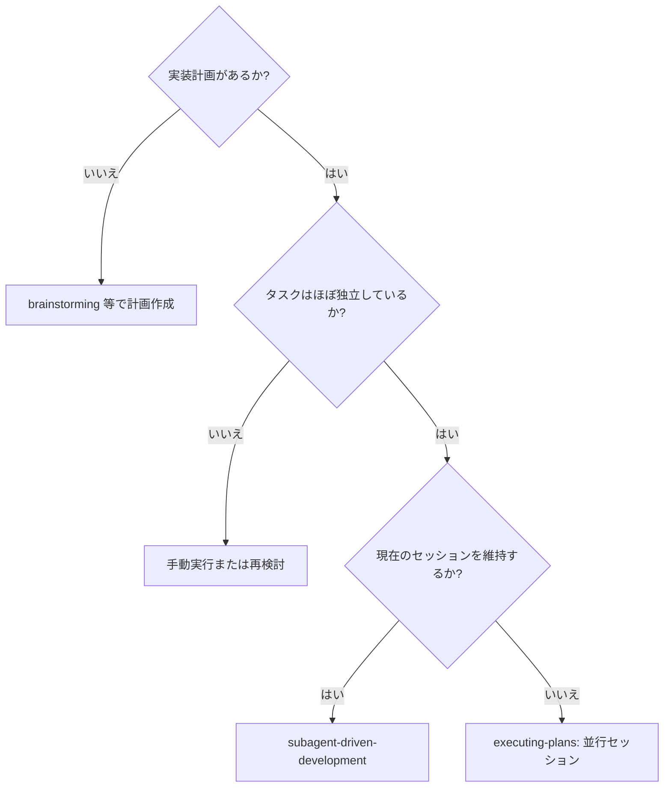
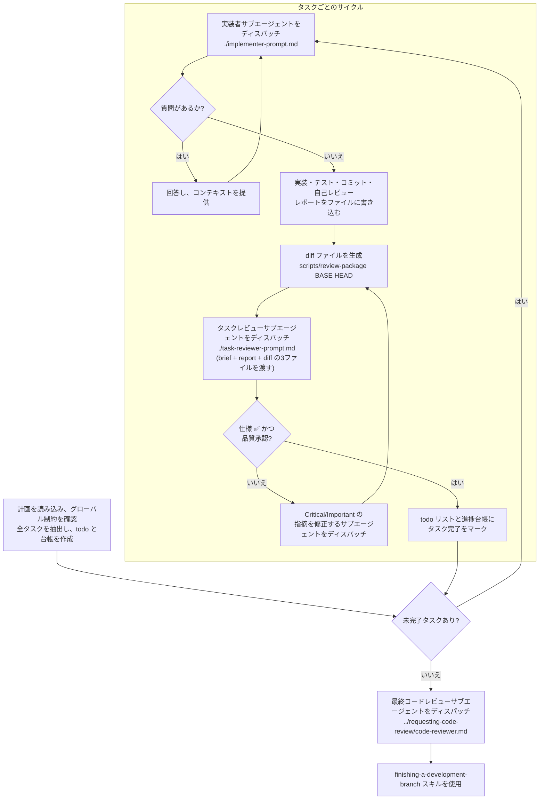

# Subagent-Driven Development

タスクごとに新鮮な実装者サブエージェントをディスパッチして計画を実行し、各タスク完了後に「タスクレビュー（仕様準拠 + コード品質）」を1回行い、最後にブランチ全体の最終レビューを行います。

**なぜサブエージェントなのか:** 隔離されたコンテキストを持つ専門エージェントにタスクを委任することで、指示とコンテキストを正確に構成し、タスクの成功を確実にします。サブエージェントはあなたのセッションのコンテキストや履歴を継承すべきではなく、必要なものだけを構築して提供します。これにより、あなた自身のコンテキストを調整作業のために温存することもできます。

**中心原則:** タスクごとの新鮮なサブエージェント + タスクレビュー（仕様 + 品質） + ブランチ全体の最終レビュー = 高品質と迅速なイテレーション

**ナレーション:** ツール呼び出しの間に行うナレーションは、最大で1行の短い文に留めてください。台帳とツール結果が記録を担います。

**継続実行の規律:** タスクの間でユーザー（人間）の手を煩わせないでください。計画にあるすべてのタスクを、停止することなく最後まで実行し続けてください。停止して良いのは以下の理由のみです：自力で解決できない BLOCKED ステータス、進行を真に妨げる曖昧さ、またはすべてのタスクが完了した時。「続けてもいいですか？」という確認や、過度な進捗サマリーは不要です。ユーザーはあなたに計画の実行を依頼したのですから、最後までやり遂げてください。

## 使用時期 (When to Use)



**executing-plans (並行セッション) との比較:**
- 同一セッション (コンテキストの切り替えなし)
- タスクごとに新鮮なサブエージェント (コンテキスト汚染なし)
- 各タスク後に1回のレビュー: 仕様準拠 + コード品質、最後に全体最終レビュー
- 迅速なイテレーション (タスク間に人間を介さない)

## プロセス (The Process)



**AIエージェントへの指示:** 以下のプロセスを厳密に実行してください。

### フェーズ 1: 準備

1. **計画ファイルの特定:** ユーザーに実装計画が記述されたファイルのパスを尋ねてください。
2. **計画の読み込みとコンテキストの把握:** 計画ファイルを読み込み、グローバル制約を確認し、実行すべき個別のタスクをすべて特定・抽出します。
3. **進捗台帳の確認:**
   ```bash
   cat "$(git rev-parse --show-toplevel)/.superpowers/sdd/progress.md"
   ```
   台帳に「完了」とマークされたタスクは完了済みです。再ディスパッチしないでください。最初に完了マークがないタスクから再開します。
4. **タスクリストの作成:** 各タスクに対してtoDoを作成します。

## モデルの選択 (Model Selection)

コストを抑え速度を向上させるため、各役割に対して適切なモデルを使用してください。

- **機械的な実装タスク** (独立した関数、明確な仕様、1-2ファイル): 高速で安価なモデル（例: Antigravity Flash）を使用してください。計画が十分に定義されていれば、ほとんどの実装タスクは機械的です。
- **統合と判断を要するタスク** (複数ファイルの調整、パターンマッチング、デバッグ): 標準的なモデルを使用してください。
- **アーキテクチャ、設計、およびレビュータスク**: 最も能力の高いモデル（例: Antigravity Pro）を使用してください。

**タスクの複雑さのシグナル:**
- 1-2ファイルに触れ、完全な仕様がある → 安価なモデル
- 統合の懸念があり、複数のファイルに触れる → 標準的なモデル
- 設計上の判断や広範なコードベースの理解が必要 → 最も能力の高いモデル

## ファイルハンドオフ (File Handoffs)

ディスパッチプロンプトに貼り付けたもの、またはサブエージェントが返したものはすべて、セッションの残りの間コンテキストに常駐し、後続のターンごとに再読み込みされます。成果物はファイルで受け渡しましょう：

- **タスクブリーフ:** 実装者をディスパッチする前に、`scripts/task-brief PLAN_FILE N` を実行します。これによりタスクの全文がユニークな名前のファイルに抽出され、パスが出力されます。ブリーフが要件の唯一の情報源となるようにディスパッチを組み立ててください。ディスパッチには以下を含めます：(1) このタスクがプロジェクトのどこに位置するかを1行で；(2) 「これを最初に読んでください — これがあなたの要件であり、記載の正確な値をそのまま使用してください」と紹介したブリーフのパス；(3) 以前のタスクからのインターフェースと決定事項でブリーフが把握できないもの；(4) あなたがブリーフで気づいた曖昧さの解決；(5) レポートファイルのパスとレポート規約。正確な値（数字、マジックストリング、シグネチャ、テストケース）はブリーフにのみ記載します。
- **レポートファイル:** 実装者のレポートファイルにはブリーフにちなんだ名前をつけ（ブリーフ `…/task-N-brief.md` → レポート `…/task-N-report.md`）、ディスパッチプロンプトに記述します。実装者がそこに詳細なレポートを書き、ステータス・コミット・テストのワンラインサマリー・懸念事項のみを返します。
- **レビュアーへの入力:** タスクレビュアーには3つのパス — 同じブリーフファイル、レポートファイル、レビューパッケージ — に加え、そのタスクに適用されるグローバル制約を渡します。
- 修正ディスパッチは修正レポート（テスト結果付き）を同じレポートファイルに追記し、短いサマリーを返します。再レビューは更新されたファイルを読み込みます。

## 進捗台帳 (Durable Progress)

会話メモリはコンパクション（圧縮）を乗り越えられません。実際のセッションでは、場所を失ったコントローラーが完了済みのタスクシーケンス全体を再ディスパッチした例があります — これが最もコストのかかる失敗です。進捗はtodoだけでなく台帳ファイルで追跡してください。

- スキル開始時に台帳を確認します：
  `cat "$(git rev-parse --show-toplevel)/.superpowers/sdd/progress.md"`
  そこに完了としてリストされたタスクは DONE です — 再ディスパッチしないでください；最初に完了マークがないタスクから再開します。
- タスクのレビューがクリーンになったら、他のブックキーピングと同じメッセージで台帳に1行追記します：
  `Task N: complete (commits <base7>..<head7>, review clean)`
- 台帳はあなたの復元マップです：台帳が記録したコミットは、あなたのコンテキストがその作成を記憶していなくてもgitに存在します。コンパクション後は、自分自身の記憶よりも台帳と `git log` を信頼してください。
- `git clean -fdx` は台帳を破壊します（gitにより無視されるスクラッチです）；それが発生した場合、`git log` から復元します。

## 実装者ステータスの管理 (Handling Implementer Status)

実装者サブエージェントは以下の4つのステータスのいずれかを報告します。適切に処理してください。

- **DONE:** diff ファイルを生成し（`scripts/review-package`）、タスクレビューに進んでください。
- **DONE_WITH_CONCERNS:** 実装は完了しましたが、疑問点が残っています。レビューに進む前に、その懸念事項を確認してください。懸念が正確性や範囲に関するものである場合は、レビューの前に対応してください。単なる観察（例：「このファイルが大きくなっています」）であれば、それをメモしてレビューに進んでください。
- **NEEDS_CONTEXT:** 提供されなかった情報が必要です。不足しているコンテキストを提供し、再度ディスパッチしてください。
- **BLOCKED:** タスクを完了できません。ブロック要因を評価してください：
    1. コンテキストの問題であれば、詳細を提供して同じモデルで再ディスパッチします。
    2. より高度な推論が必要な場合は、より能力の高いモデルで再ディスパッチします。
    3. タスクが大きすぎる場合は、より小さな断片に分割します。
    4. 計画自体が間違っている場合は、人間にエスカレーションします。

**決して**、実装者が「行き詰まった」と言っているのに、変更を加えずに同じモデルにリトライを強制しないでください。何らかの変更が必要です。

### フェーズ 2: タスク実行サイクル

ToDoリストの未完了タスクがなくなるまで、タスクごとに以下のサイクルを繰り返します。

1. **次のタスクの特定:** 現在のタスクリストを確認し、次の未完了タスクを「実行中 (In Progress)」に更新します。
2. **タスクブリーフの生成:** `scripts/task-brief PLAN_FILE N` を実行してブリーフファイルを生成し、パスを取得します。
3. **実装者 (Implementer) のディスパッチ:** `./implementer-prompt.md` を使用して実装サブエージェントを起動します（ブリーフのパスとレポートファイルのパスを渡します）。
4. **レビューパッケージの生成:** `scripts/review-package BASE HEAD` を実行してdiffファイルを生成します。
5. **タスクレビュー (Task Reviewer) のディスパッチ:** `./task-reviewer-prompt.md` を使用してレビューサブエージェントを起動します（ブリーフ・レポート・diffの3ファイルを渡します）。
6. **タスク完了:** タスクレビューで承認されたら、タスクを「完了 (Completed)」に更新し、進捗台帳に1行追記します。

### フェーズ 3: 最終化

1. **全タスク完了の確認:** すべてのタスクが完了したことを確認します。
2. **最終レビュー:** `../requesting-code-review/code-reviewer.md` を使用して最終コードレビューアをディスパッチし、全体の実装に矛盾がないか確認します。
3. **開発ブランチの完了:** `finishing-a-development-branch` スキルを起動し、最終作業を行ってください。

## プロンプトテンプレート (Prompt Templates)

- [implementer-prompt.md](implementer-prompt.md) - 実装者サブエージェントをディスパッチ
- [task-reviewer-prompt.md](task-reviewer-prompt.md) - タスクレビューサブエージェントをディスパッチ（仕様準拠 + コード品質の1回レビュー）
- 最終全体レビュー: `superpowers:requesting-code-review` の [code-reviewer.md](../requesting-code-review/code-reviewer.md) を使用

## 例示ワークフロー

```
あなた: この計画を実行するためにサブエージェント駆動開発を使用しています。

[進捗台帳を確認]
[計画ファイルを一度読み込む: docs/plans/feature-plan.md]
[グローバル制約を確認]
[全タスクに対してtodoを作成]

タスク 1: フックインストールスクリプト

[scripts/task-brief を実行してブリーフファイルを生成]
[ブリーフ + レポートパス + コンテキストを含む完全なプロンプトで実装サブエージェントをディスパッチ]

実装者: 「開始する前に - フックはユーザーレベルまたはシステムレベルのどちらにインストールすべきですか？」

あなた: 「ユーザーレベル (~/.config/superpowers/hooks/)」

実装者: 「了解しました。今から実装します...」
[その後] 実装者:
  - インストールフックコマンドを実装
  - テストを追加、5/5 合格
  - 自己レビュー: --force フラグを見落としていたため追加
  - コミット済み
  - レポートを task-1-report.md に書き込み済み

[scripts/review-package を実行してdiffファイルを生成]
[ブリーフ + レポート + diff の3ファイルを渡してタスクレビューアをディスパッチ]
タスクレビューア: 仕様 ✅ - すべての要件を満たしており、余分なものなし。
  強み: 良好なテストカバレッジ、クリーン。問題点: なし。タスク品質: 承認済み。

[タスク 1 を完了としてマーク、台帳に追記]

タスク 2: 回復モード

[scripts/task-brief を実行してブリーフファイルを生成]
[ブリーフ + レポートパス + コンテキストを含む完全なプロンプトで実装サブエージェントをディスパッチ]

実装者: [質問なし、続行]
実装者:
  - 検証/修復モードを追加
  - 8/8 テスト合格
  - 自己レビュー: 全て良好
  - コミット済み

[scripts/review-package を実行してdiffファイルを生成]
[タスクレビューアをディスパッチ]
タスクレビューア: 仕様 ❌:
  - 欠落: 進捗報告 (仕様では「100項目ごとに報告」と記載)
  - 余分: --json フラグを追加 (要求されていない)
  問題点 (重要): マジックナンバー (100)

[指摘事項を含む修正サブエージェントをディスパッチ]
修正者: --json フラグを削除、進捗報告を追加、PROGRESS_INTERVAL 定数を抽出

[タスクレビューアが再レビュー]
タスクレビューア: 仕様 ✅。タスク品質: 承認済み。

[タスク 2 を完了としてマーク、台帳に追記]

...

[すべてのタスク完了後]
[最終コードレビューアをディスパッチ]
最終レビューア: すべての要件を満たしています。マージ準備完了。

完了！
```

## 利点 (Advantages)

**手動実行との比較:**
- サブエージェントは自然に TDD に従う
- タスクごとに新鮮なコンテキスト (混乱の防止)
- 並行安全 (サブエージェントは互いに干渉しない)
- サブエージェントは作業前および作業中に質問が可能

**Executing Plans との比較:**
- 同一セッション (ハンドオフの手間がない)
- 継続的な進捗 (待機時間なし)
- レビューチェックポイントの自動化

**効率の向上:**
- コントローラーが必要なコンテキストを正確にキュレーション；大きな成果物はテキストの貼り付けではなくファイルで受け渡し
- サブエージェントは事前に完全な情報を取得できる
- 作業開始前に質問が表面化する (後出しにならない)

**品質ゲート:**
- 自己レビューにより引き渡し前に問題を捕捉
- タスクレビューで2つの評価: 仕様準拠とコード品質
- レビューループにより修正が実際に機能することを保証
- 仕様準拠により過剰/不十分な構築を防止
- コード品質により実装が適切に構築されていることを保証

**コスト:**
- より多くのサブエージェント呼び出し (タスクごとに実装者 + レビューア)
- コントローラーがより多くの準備作業を行う (事前にすべてのタスクを抽出)
- レビューループにより反復が増える
- しかし早期に問題を捕捉できる (後でデバッグするより安価)

## 重要なルール (Red Flags)

**決して以下のことをしないでください:**
- 明示的なユーザーの同意なしに main/master ブランチで実装を開始する。
- タスクレビューをスキップする、または仕様準拠とタスク品質の両方の評価が欠けているレポートを承認する。
- 未修正の問題があるまま続行する。
- 複数の実装サブエージェントを並行してディスパッチする (競合防止)。
- サブエージェントに計画ファイル全体を読み込ませる (`scripts/task-brief` でブリーフを渡す)。
- 場面設定のコンテキストを省略する (サブエージェントは全体像を理解する必要がある)。
- サブエージェントの質問を無視する (続行前に必ず回答する)。
- 仕様準拠において「十分近い」で妥協する (レビューアが仕様の問題を発見した場合、未完了とみなす)。
- レビューループをスキップする (レビューアが問題を発見したら、修正サブエージェントが修正し、再度レビューする)。
- レビューアにフラグを立てないよう指示したり、ディスパッチプロンプトで指摘の重大度を事前に評価する（「せいぜいMinorとして扱え」など）。
- diff ファイルなしでタスクレビューアをディスパッチする — まず生成してから (`scripts/review-package BASE HEAD`) プロンプトにそのパスを記述する。
- Critical/Important の指摘が未解決のまま次のタスクに進む。
- 進捗台帳に完了とマークされているタスクを再ディスパッチする — コンパクションや再開後は台帳（と `git log`）を確認すること。

**サブエージェントが質問した場合:**
- 明確かつ完全に回答する。
- 必要に応じて追加のコンテキストを提供する。
- 実装を急がせない。

**レビューアが問題を発見した場合:**
- 修正サブエージェントをディスパッチして修正させる。
- レビューアが再レビューする。
- 承認されるまで繰り返す。
- 再レビューをスキップしない。

**サブエージェントがタスクに失敗した場合:**
- 特定の指示を与えて修正サブエージェントをディスパッチする。
- 手動で修正しようとしない (コンテキスト汚染防止)。

## 連携スキル (Integration)

**必須のワークフロースキル:**
- **using-git-worktrees** - 隔離されたワークスペースを確保します（新規作成、または既存の検証）。
- **writing-plans** - このスキルが実行する計画を作成する。
- **requesting-code-review** - 最終ブランチ全体レビューのコードレビューテンプレート。
- **finishing-a-development-branch** - 全タスク完了後の開発完了処理。

**サブエージェントが使用すべきスキル:**
- **test-driven-development** - 各タスクで TDD に従う。

**代替ワークフロー:**
- **executing-plans** - 同一セッションではなく並行セッションで実行する場合に使用。
