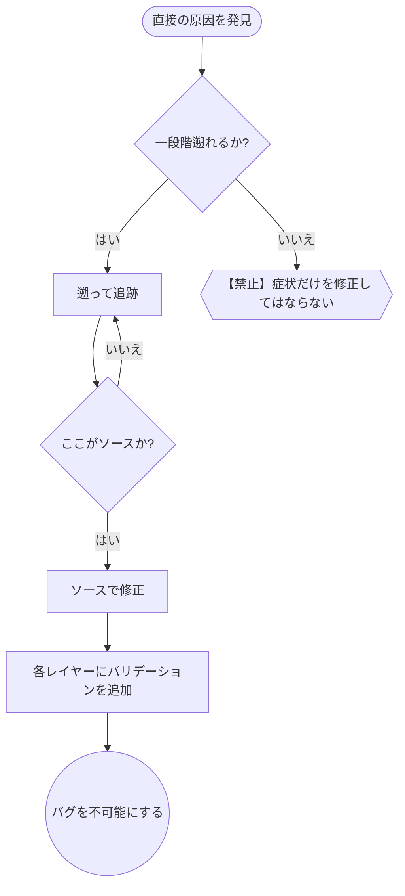

# 根本原因の追跡 (Root Cause Tracing)

## 概要

バグはしばしばコールスタックの深い場所で表面化します（例：誤ったディレクトリでの git init、誤った場所でのファイル作成、誤ったパスでのデータベースオープン）。エラーが発生した場所を修正したくなりますが、それは多くの場合「症状」を治療しているに過ぎません。

**中核原則:** コールチェーンを遡って元のトリガーを特定し、ソース（発生源）で修正すること。

## 中核原則



**エラーが発生した場所だけを修正してはいけません。** 遡って元のトリガーを見つけてください。

**ユースケース:**
- エラーが実行の深い場所で発生している（エントリポイントではない）
- スタックトレースに長いコールチェーンが表示されている
- 無効なデータや状態がどこから来たのか不明である
- どのテストやコードが問題を引き起こしているか特定する必要がある

## 追跡プロセス

### 1. 症状を観察する
```
Error: git init failed in /Users/jesse/project/packages/core
```

### 2. 直接の原因を見つける
**どのコードが直接これを引き起こしているか？**
```typescript
await execFileAsync('git', ['init'], { cwd: projectDir });
```

### 3. 「何がこれを呼んだのか？」を問う
```typescript
WorktreeManager.createSessionWorktree(projectDir, sessionId)
  → Session.initializeWorkspace() によって呼び出し
  → Session.create() によって呼び出し
  → Project.create() のテストによって呼び出し
```

### 4. さらに遡る
**どのような値が渡されたか？**
- `projectDir = ''` (空文字列！)
- `cwd` として空文字列を渡すと `process.cwd()` に解決される。
- つまり、ソースコードのあるディレクトリだ！

### 5. 元のトリガーを特定する
**空文字列はどこから来たのか？**
```typescript
const context = setupCoreTest(); // { tempDir: '' } を返す
Project.create('name', context.tempDir); // beforeEach の実行前にアクセスされている！
```

## スタックトレースの追加

手動での追跡が困難な場合は、計測コード（インストルメンテーション）を追加します。

```typescript
// 問題のある操作の直前
async function gitInit(directory: string) {
  const stack = new Error().stack;
  console.error('DEBUG git init:', {
    directory,
    cwd: process.cwd(),
    nodeEnv: process.env.NODE_ENV,
    stack,
  });

  await execFileAsync('git', ['init'], { cwd: directory });
}
```

**重要:** テストでは `console.error()` を使用してください（ロガーは抑制される可能性があるため）。

**実行とキャプチャ:**
```bash
npm test 2>&1 | grep 'DEBUG git init'
```

**スタックトレースの分析:**
- テストファイル名を探す。
- 呼び出しをトリガーしている行番号を特定する。
- パターン（同じテストか？同じパラメータか？）を特定する。

## どのテストが汚染を引き起こしているか探す

テスト中に何かが発生しているが、どのテストが原因か分からない場合：

このディレクトリにあるバイセクションスクリプト `find-polluter.sh` を使用します。

```bash
./find-polluter.sh '.git' 'src/**/*.test.ts'
```

テストを一つずつ実行し、最初に汚染（pollution）を引き起こしたテストで停止します。

## 中核原則


**エラーが発生した場所だけを修正してはいけません。** 遡って元のトリガーを見つけてください。

## 実例：空の projectDir

**症状:** `packages/core/`（ソースコードディレクトリ）内に `.git` が作成される。

**追跡チェーン:**
1.  `git init` が `process.cwd()` で実行されている ← `cwd` パラメータが空だった。
2.  `WorktreeManager` が空の `projectDir` で呼び出された。
3.  `Session.create()` に空文字列が渡された。
4.  テストが `beforeEach` の実行前に `context.tempDir` にアクセスしていた。
5.  `setupCoreTest()` が初期値として `{ tempDir: '' }` を返していた。

**根本原因:** 最上位レベルの変数初期化が、空の値にアクセスしていた。

**修正:** `tempDir` をゲッター（getter）にし、`beforeEach` の前（値が設定される前）にアクセスされた場合にエラーを投げるようにした。

**さらに多層防御を追加:**
- レイヤー 1: `Project.create()` がディレクトリの「空チェック/存在/書き込み権限」をバリデーションする。
- レイヤー 2: `WorkspaceManager` が `projectDir` が空でないことをバリデーションする。
- レイヤー 3: `NODE_ENV` ガードにより、テスト中に一時ディレクトリ以外での `git init` を拒否する。
- レイヤー 4: `git init` の直前にスタックトレースをログ出力する。

## スタックトレースのヒント

- **テスト内:** `console.error()` を使用する。ロガーは出力が抑制されることがある。
- **操作の直前:** 失敗した後ではなく、危険な操作が行われる **直前** にログを出力する。
- **コンテキストを含める:** ディレクトリ、cwd、環境変数、タイムスタンプなど。
- **スタックの取得:** `new Error().stack` で完全なコールチェーンを表示する。

## 実世界への影響

あるデバッグセッション（2025-10-03）の例：
- 5 段階の追跡（5-level trace）を通じて根本原因を特定。
- 発生源（ゲッターのバリデーション）で修正。
- 4 つの防御レイヤーを追加。
- 1847 個のテストがパスし、汚染（Pollution）はゼロになった。
