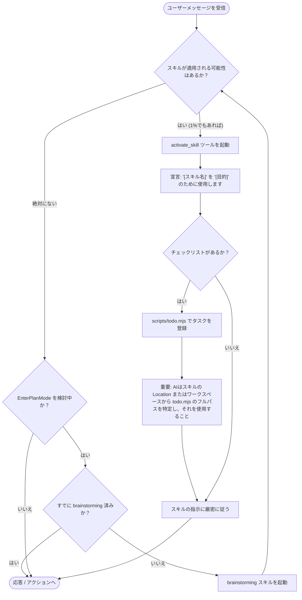

<SUBAGENT-STOP>
もしあなたが特定のタスクを実行するためにサブエージェントとして派遣されたのであれば、このスキルをスキップせよ。
</SUBAGENT-STOP>

<EXTREMELY-IMPORTANT>
自分の作業にスキルが適用される可能性が1%でもあると思うなら、必ずそのスキルを起動しなければならない。

タスクに適用可能なスキルが存在する場合、選択の余地はない。必ず使用すること。

これは交渉の余地がなく、オプションでもない。いかなる自己正当化（rationalization）も認められない。
</EXTREMELY-IMPORTANT>

## 指示の優先順位

Superpowers スキルはデフォルトのシステムプロンプトの挙動を上書きするが、**ユーザーの指示が常に最優先される**:

1. **ユーザーによる明示的な指示** (CLAUDE.md, GEMINI.md, AGENTS.md, 直接の依頼) — 最優先
2. **Superpowers スキル** — 競合する場合、デフォルトのシステム挙動を上書き
3. **デフォルトのシステムプロンプト** — 最低優先

もし CLAUDE.md, GEMINI.md, または AGENTS.md に「TDD を使うな」とあり、スキルに「常に TDD を使え」とある場合は、ユーザーの指示に従え。ユーザーがコントロールを握っている。

## スキルへのアクセス方法

**Claude Codeにおいて:** `Skill` ツールを使用せよ。スキルを呼び出すとその内容がロードされ、提示される。それに直接従うこと。スキルファイルを直接 `read_file` 等で読み込むのは避けるべきである。

**Copilot CLIにおいて:** `skill` ツールを使用せよ。インストールされたプラグインからスキルが自動的に発見される。`skill` ツールの動作は Claude Code の `Skill` ツールと同様である。

**Gemini CLIにおいて:** `activate_skill` ツールを使用せよ。Gemini はセッション開始時にスキルのメタデータをロードし、要求に応じて完全な内容（instructions）を有効化する。

**その他の環境:** スキルがどのようにロードされるかについては、各プラットフォームのドキュメントを確認せよ。

## プラットフォーム適応 (Platform Adaptation)

スキルは Claude Code のツール名を使用している。非 CC プラットフォームについては、ツールの対応関係について `references/copilot-tools.md` (Copilot CLI) や `references/codex-tools.md` (Codex) を参照せよ。Gemini CLI ユーザーは、GEMINI.md を介して自動的に読み込まれるツールマッピングを利用できる。

# スキルの使用

## ルール

**いかなる応答やアクション（明確化の質問を含む）を行う前に、関連するスキルや要求されたスキルを起動せよ。** スキルが適用される可能性が1%でもあるなら、起動して確認しなければならない。起動したスキルがその状況に適していないと判断した場合は、無理に使用し続ける必要はない。

## レッドフラッグ（警告サイン）

以下のような考えが浮かんだら、それは「スキルを使わないための自己正当化」であり、直ちに立ち止まる必要がある。

| 思考 | 現実 |
| :--- | :--- |
| 「これは単純な質問に過ぎない」 | 質問はタスクである。スキルの有無を確認せよ。 |
| 「まずもっとコンテキストが必要だ」 | スキルの確認は、明確化の質問をする「前」に行う。 |
| 「コードベースを少し探索してからにしよう」 | スキルは「どのように」探索すべきかを教えてくれる。まず確認せよ。 |
| 「Gitやファイルを素早くチェックできる」 | ファイルだけでは会話のコンテキストが欠けている。スキルを確認せよ。 |
| 「まず情報を収集させてくれ」 | スキルは「どのように」情報を収集すべきかを教えてくれる。 |
| 「これには正式なスキルは必要ない」 | スキルが存在するなら、それを使え。 |
| 「このスキルなら覚えている」 | スキルは進化する。現在の最新バージョンを読み込め。 |
| 「これはタスクには当たらない」 | アクション = タスクである。スキルの有無を確認せよ。 |
| 「このスキルはやり過ぎ（オーバーキル）だ」 | 単純なことも複雑化する。規律のために使用せよ。 |
| 「まずこれ一つだけ終わらせよう」 | 何かを行う「前」に確認せよ。 |
| 「これは生産的に感じる」 | 無秩序な行動は時間を無駄にする。スキルはそれを防ぐ。 |
| 「その意味なら知っている」 | 概念を知っていることと、スキルを使うことは別である。起動せよ。 |

## スキルの優先順位

複数のスキルが適用可能な場合は、以下の順序に従う。

1. **プロセス系スキルを優先** (`brainstorming`, `systematic-debugging` 等) - これらはタスクへの「アプローチ方法」を決定する。
2. **実装系スキルを次に適用** (`setup-react-project`, `create-ui-component` 等) - これらは「実行」をガイドする。

例：「Xを作ろう」→ まず `brainstorming`、その後に実装系スキル。
例：「このバグを直して」→ まず `systematic-debugging`、その後にドメイン固有のスキル。

## スキルの種類

**厳格型 (Rigid)** (`test-driven-development`, `systematic-debugging`等):
手順に厳密に従え。規律を緩めて適応させてはならない。

**柔軟型 (Flexible)** (`brainstorming`等):
原則をコンテキストに適応させよ。

どちらのタイプかは、各スキルの説明に記載されている。

## ユーザーの指示

ユーザーの指示は「何を (WHAT)」するかであり、「どのように (HOW)」するかではない。「Xを追加して」「Yを直して」という指示は、定義されたワークフローやスキルをスキップして良いという意味ではない。
